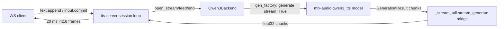
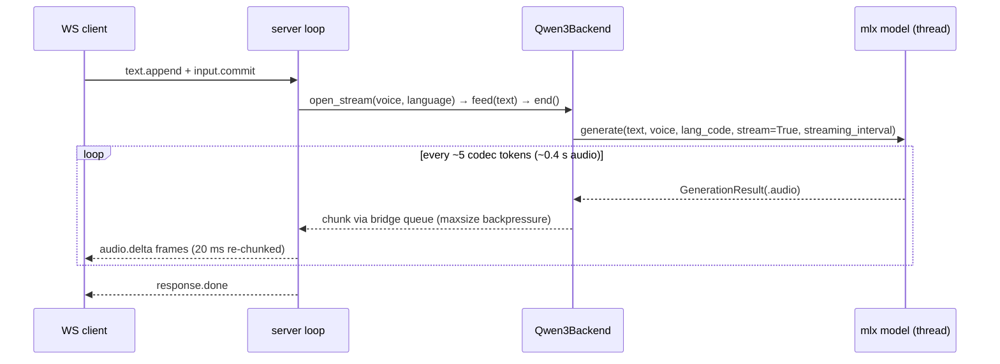

# Task: tts-server — `qwen3_tts` streaming backend

**Status**: Complete
**Completed**: 2026-07-03
**Component**: tts-server (backends)
**Assigned to**: Varun Singh
**Priority**: Medium
**Branch**: `feature/tts-qwen3-backend` (off `main` @ `093e65f`)
**Created**: 2026-07-03

## Objective

Add a `qwen3_tts` streaming TTS backend (mlx-community/Qwen3-TTS-12Hz-0.6B-**CustomVoice**-bf16
via the already-pinned mlx-audio 0.4.4) as a voxtral-derived sub-segment streamer behind its own
lazy extra, with tests, justfile smoke recipes, and a cross-backend profiling entry. **No
server-side changes** — the backend plugs into the existing session loop / re-chunker /
`_stream_util` bridge.

> **Post-gate re-plan (2026-07-03).** The plan originally targeted the `0.6B-Base-bf16` variant
> on the assumption it carried named speakers. Gate Q3 falsified that: Base's config has
> `spk_id: {}` (no speakers; voice-cloning/unconditioned only). The CustomVoice variant carries
> 9 named speakers, routes through the SAME `generate(voice=…, stream=True,
> streaming_interval=…)` entry (`qwen3_tts.py:1219-1236` → `generate_custom_voice`), and passed
> gate Q1/Q2/Q3/Q5 with equivalent latency. Default model is therefore CustomVoice; Base remains
> usable via `--model` as a no-voice (`voices() == []`) model. See `## Findings`.

## Context

- mlx-audio 0.4.4 (the R8-pinned version this project already installs) ships the `qwen3_tts`
  model family — this backend needs **no pin bump**, unlike every other candidate model family.
- Qwen3-TTS is multilingual (7 named speakers per the family README: 2 English, 5 Chinese incl.
  dialects) with upstream README claims of RTF ~1.67x, TTFB ~85 ms, ~3.9 GB, 24 kHz — **unverified
  on this machine**.
- Its `generate(stream=True, streaming_interval=…)` shape matches the Voxtral backend template,
  so the net-new work is a Phase-0 verification gate (dia precedent: the gate falsified a core
  assumption and forced a re-plan *before* wiring) plus the standard backend-add wiring.
- Out of scope for v1 of this backend: voice cloning (`ref_audio`+`ref_text` — the WS protocol
  cannot carry reference audio), the VoiceDesign variant and the `instruct` (emotion/style) knob
  (the backend never passes `instruct`, even though the CustomVoice entry point accepts it),
  and the `repetition_penalty`/`speed`/`split_pattern`/`max_tokens`/`streaming_context_size`
  sampling knobs. Out-of-scope kwargs are **actively guarded** (lean negative tests, Phase 1),
  not merely undocumented — `generate()` accepts them all and ICL cloning silently activates
  when `ref_audio`+`ref_text` are present (`qwen3_tts.py:1241-1265`).

## Requirements

- Backend name, extra name, and justfile recipe suffix are all **`qwen3_tts`** (consistent with
  `voxtral_tts` / `pocket_tts`).
- Default model `mlx-community/Qwen3-TTS-12Hz-0.6B-CustomVoice-bf16`, exported as
  `DEFAULT_QWEN3_MODEL` (gate-verified: 9 speakers, streaming parity with Base, apache-2.0).
  `--model mlx-community/Qwen3-TTS-12Hz-0.6B-Base-bf16` remains supported as a no-voice model
  (`voices() == []`; backend omits the `voice` kwarg — base path is speaker-unconditioned).
- Lean-base invariant holds: `import tts_server` and `make_backend("qwen3_tts", …)` succeed with
  only the lean base installed; `mlx_audio` enters the process only in `start()`. Enforced by a
  dedicated `tests/test_qwen3_lean.py` (every sibling backend has one) wired into the CI lean
  allowlist.
- Streaming backend contract: `capabilities()["streaming"] is True`; sub-segment chunks flow
  through the shared `_stream_util.stream_generate` bridge; `sample_rate` read from
  `model.sample_rate` in `start()` before warmup (never hardcode 24000 — the ModelConfig default
  is a dataclass default, not the repo-confirmed value; the gate records the real one).
- Voice knob maps to named speakers (`generate(voice=<speaker>)`). `voices()` enumerates
  dynamically from `model.get_supported_speakers()` (which reads `config.talker_config.spk_id`)
  — do NOT hardcode the speaker list, and advertise the **exact-case** strings the model returns
  (gate-verified all-lowercase: `serena, vivian, uncle_fu, ryan, aiden, ono_anna, sohee, eric,
  dylan`; the server validates verbatim against `frozenset(voices())`, `server.py:775`).
  CustomVoice models REQUIRE a voice (`generate()` raises without one, `qwen3_tts.py:1219-1222`):
  when the client sends no voice, the backend injects `DEFAULT_QWEN3_VOICE = "ryan"` (English
  male; perceptual confirmation lands in the smoke run). When `voices()` is empty (Base models),
  the backend omits the `voice` kwarg entirely (unconditioned path, dia-style `voice_count: 0`).
- **Language policy**: advertise `capabilities()["languages"]` dynamically from
  `model.get_supported_languages()`; `open_stream(language=…)` maps the client's validated
  `language` to `generate(lang_code=…)`, defaulting to `"auto"` when the client sends none. (The
  server validates client `language` against advertised capabilities and forwards it into
  `open_stream` — `server.py:718-733, 1170` — so "always auto" would contradict what we
  advertise.)
- Sampling extras mirror Voxtral's set (`temperature`, `top_k`, `top_p`) with clamped bounds;
  `streaming_interval` is backend config, never an advertised extra.
- Phase 0 is a **hard gate**: its questions (below) must be answered on this machine before any
  backend code is written. A falsified assumption triggers a re-plan, not a workaround.
- Tests mirror the sibling-backend two-layer pattern: `tests/test_qwen3_backend.py` (mlx-gated)
  + `tests/test_qwen3_lean.py` (lean, CI-runnable).
- justfile gains `smoke-qwen3_tts` and `smoke-multiconn-qwen3_tts` recipes; the smoke shell
  scripts' hardcoded backend allowlists MUST be extended in the same commit (they `exit 2` on
  unknown backends — this is a required edit, not a conditional).
- **Backend-set drift invariant** (enforced by `tests/test_justfile_recipes.py`): argparse
  `--backend` choices == README port-convention table == `render_tts_plist._BACKEND_RE` ==
  justfile `_resolve` map. Adding `qwen3_tts` to any one without all others breaks existing
  tests. Canonical port assignment: **9165** (next in the +100 sequence 8665…9065).
- Profiling: `rtf_benchmark.py --backend qwen3_tts` run added to the comparison table in
  `scripts/profiling/README.md` (TTFB/RTF; **peak memory is measured in the Phase-0 direct-MLX
  gate**, not by the profiler — the bridge discards `GenerationResult.peak_memory_usage`).
- Docs updated alongside code: README backend + port tables, AGENTS.md if it lists backends,
  `tests/smoke/README.md` weights/license note. The license is **unknown until verified** — the
  Phase-0 gate records the actual HF license file contents into `## Findings`, and the smoke
  README note quotes it verbatim (Qwen models ship under Apache-2.0 *or* Qwen-specific licenses;
  do not pre-assume).

## Review Focus

- **Phase-0 gate completeness**: does the gate actually falsify the assumptions the later phases
  depend on (incremental yield, cross-segment state, `voice=None` behavior, speaker list casing,
  languages, sample rate, license)?
- **Voice/None semantics (gate-decided)**: CustomVoice REQUIRES voice → backend injects
  `DEFAULT_QWEN3_VOICE = "ryan"` on None. Base has no speakers → backend omits `voice` kwarg
  (speaker-unconditioned, `qwen3_tts.py:381-389`). Review should check both branches and that
  the injected default is a member of the discovered `voices()` when non-empty.
- **Chunk cadence math**: qwen3's chunk quantum is `max(1, int(streaming_interval * 12.5))` codec
  tokens (12.5 tokens/s) — the provisional `_STREAMING_INTERVAL = 0.4` (5 tokens ≈ 0.4 s audio)
  differs from Voxtral's 0.3 semantics; TTFB math in review should use tokens, not seconds.
- **Lean-base invariant**: no module-load import of `mlx_audio`/`numpy` in the new module.
- **Out-of-scope kwarg guard**: cloning/style/control kwargs must be provably unable to reach
  `generate()` (lean spy-model tests), since `ref_audio`+`ref_text` silently activate cloning.
- **Drift invariant**: argparse == README port table == `_BACKEND_RE` == justfile `_resolve`.

## Implementation Checklist

### Phase 0: Model verification gate (dia precedent)

**Impl files:** `tests/smoke/qwen3_phase0_gate.py`
**Test files:** `tests/smoke/qwen3_phase0_gate.py`
**Test command:** `uv run --extra dia python tests/smoke/qwen3_phase0_gate.py`

Standalone script (mlx-audio direct, no server) that downloads the model once and answers, with
printed PASS/FAIL per question. The `--extra dia` supplies mlx-audio 0.4.4 (the `qwen3_tts` extra
does not exist until Phase 2; a bare `uv run` re-syncs to lean base and strips mlx-audio — any
existing mlx extra works).

- **Q1 — incremental streaming**: does `generate(stream=True, streaming_interval=0.4)` yield ≥2
  chunks for a single-sentence utterance, with wall-clock gaps between yields (i.e. genuinely
  incremental, not batched-at-end)? Record chunk count and each yield's `is_streaming_chunk` /
  `is_final_chunk` values as present (streaming yields set `is_streaming_chunk=True`; only the
  terminal yield sets `is_final_chunk` — `qwen3_tts.py:1445-1524`). Note: incremental-*timing* is
  a gate-only assertion; the Phase-1 unit test only counts chunks (Voxtral precedent).
- **Q2 — latency + memory**: measure TTFB (first chunk wall time) and full-utterance RTF for a
  short and a ~15 s utterance, at `streaming_interval` 0.4 and the 2.0 default. Record **peak
  memory here** (via `GenerationResult.peak_memory_usage` / `mx.get_peak_memory()`) — the Phase-3
  profiler cannot see it (the bridge strips everything but PCM).
- **Q3 — speakers + languages + rate**: print `model.get_supported_speakers()` **verbatim**
  (exact casing — the family README is inconsistent, `ryan` vs `Ryan`, and server-side voice
  validation is case-exact while `generate()` lowercases) and `model.get_supported_languages()`;
  confirm English speakers exist in THIS model's `spk_id` (family README claims are not
  model-config facts). Record `model.sample_rate` actually reported.
- **Q4 — `voice=None`**: verify the no-speaker path — base models generate speaker-unconditioned
  output (no default, no error, per `qwen3_tts.py:381-389`). Listen to it. Decide: inject a
  discovered default speaker (and which one) vs omit and accept unconditioned output.
- **Q5 — cross-segment state**: with a seeded two-line (`\n`-separated) input, is segment 2's
  audio affected by editing segment 1 (dia-style autoregressive coupling)? And are two separate
  `generate()` calls independent? Use the dia gate's A/B/C seeded-comparison method.
- **Q6 — license**: fetch/read the HF repo's license file for
  `mlx-community/Qwen3-TTS-12Hz-0.6B-Base-bf16` (and the upstream Qwen3-TTS license it mirrors);
  record the exact license into `## Findings` for the Phase-2 smoke-README note.
- Also record: audio sanity (no NaN, not clipped, audible speech written to WAV for perceptual
  check of both English speakers).

**GATE**: Q1 false → re-shape as segment-level `streaming:false` backend (kokoro-like) — re-plan.
Q5 shows cross-call state → dia-precedent re-plan. Q3/Q4 surprises → update Phase 1 defaults
before proceeding. Findings land in `## Findings` below the marker.

### Phase 1: Backend module + unit tests (mlx-gated + lean)

**Impl files:** `tts_server/backends/qwen3_tts.py`
**Test files:** `tests/test_qwen3_backend.py, tests/test_qwen3_lean.py`
**Test command:** `uv run pytest tests/test_qwen3_backend.py tests/test_qwen3_lean.py -v`

- New `Qwen3Backend` derived from the Voxtral template (`voxtral_tts.py`): lazy `load()` in
  `start()`, `sample_rate` from `model.sample_rate` pre-warmup (never hardcoded), warmup synth,
  `open_stream()` returning a stream whose `events()` drains `generate(text, stream=True,
  streaming_interval=_STREAMING_INTERVAL, **kwargs)` through `stream_generate` with
  `maxsize=_BRIDGE_MAXSIZE`.
- `_STREAMING_INTERVAL` module constant, value set from Phase 0 Q2 findings (provisional 0.4).
- Voice handling per gate decision: inject `DEFAULT_QWEN3_VOICE = "ryan"` when the client sends
  none AND `voices()` is non-empty; omit the `voice` kwarg when `voices()` is empty (Base
  models, unconditioned path). `voices()` dynamic via `get_supported_speakers()` with exact-case
  strings. NOTE: `_discover_voices` here is **net-new code**, not a Voxtral copy (Voxtral walks
  `_voice_embedding_files`; qwen3 reads model API). Empty `get_supported_speakers()` is a VALID
  state (Base), not an error — `voice_count: 0`, no static fallback list (a fake list would
  advertise voices the model ignores).
- Language mapping: `open_stream(language=…)` → `generate(lang_code=…)`, `None` → `"auto"`;
  `capabilities()["languages"]` from `get_supported_languages()` (gate-informed static fallback).
- Extras: exactly `temperature`, `top_k`, `top_p` with validation/clamping mirroring Voxtral's
  `validate_extras()`. **Negative guard**: out-of-scope kwargs (`ref_audio`, `ref_text`,
  `instruct`, `speed`, `split_pattern`, `max_tokens`, `streaming_context_size`,
  `repetition_penalty`) must never reach `generate()` even if injected via `open_stream` extras.
- `capabilities()`: `streaming: True`, `voice_count` from discovered list, `languages` dynamic,
  `ideal_words`/`max_text_chars` gate-informed; `streaming_interval` NOT in `extras`.
- `tests/test_qwen3_backend.py` (mlx-gated) mirrors `test_voxtral_backend.py`: module-scoped
  `started_backend`, `pytest.importorskip("mlx_audio")`, ≥2-chunk streaming test, NaN/clip test,
  hello-rate test via `tests/_helpers.py`. It imports `Qwen3Backend` **directly** (not via
  `make_backend`), so the Phase-1 commit stays green before the Phase-2 registry branch exists.
- `tests/test_qwen3_lean.py` (no mlx) mirrors `test_voxtral_lean.py`: subprocess lean-import
  check (module import pulls no mlx), `make_backend("qwen3_tts")` constructs without mlx
  (this test lands green only after Phase 2 wires the registry — mark xfail/skip until then or
  fold into Phase 2's run), locked-value assertion `_STREAMING_INTERVAL == <final>` plus
  `max(1, int(_STREAMING_INTERVAL * 12.5)) == <expected tokens>`, `streaming: True` caps shape,
  `"streaming_interval" not in caps["extras"]` and `caps["extras"] == ["temperature", "top_k",
  "top_p"]`, spy-model tests for BOTH voice branches (None→`"ryan"` injection when voices
  non-empty; kwarg omitted when voices empty), the language→lang_code mapping, and the
  forbidden-kwargs negative guard.
- Cancel-mid-stream/bridge-teardown and `wait_closed` (SupportsWaitClosed slot-accounting,
  protocol.md §7) are covered by the backend-agnostic `tests/test_streaming_and_cancel.py`
  suite — cite in test docstrings rather than duplicating.

### Phase 2: Wiring — registry, CLI, extra, justfile, smoke scripts, renderer, docs

**Impl files:** `tts_server/backends/__init__.py, tts_server/__main__.py, pyproject.toml, uv.lock, justfile, scripts/render_tts_plist.py, tests/smoke/run_smoke.sh, tests/smoke/run_multiconn.sh, .github/workflows/test.yml, tests/test_import_safety.py, README.md, AGENTS.md, tests/smoke/README.md`
**Test files:** `tests/test_qwen3_lean.py`
**Test command:** `uv run pytest tests/ -q`
**Validation cmd:** `just smoke-qwen3_tts`

All of the following are **one atomic unit** — the smoke scripts auto-run
`uv sync --extra "$BACKEND"`, so the extra, the allowlists, the recipes, and the registry must
land in the same commit or `just smoke-qwen3_tts` is red at every intermediate point:

- `make_backend` branch for `"qwen3_tts"` (lazy import, `model or DEFAULT_QWEN3_MODEL`, same
  comment discipline as siblings).
- `tts_server/__main__.py`: add `qwen3_tts` to the argparse `--backend` choices (lines ~359-360)
  and to the backend→default-model resolution map (lines ~45-61).
- `pyproject.toml` extra: `qwen3_tts = ["websockets>=13.0", "mlx-audio==0.4.4"]` (transformers is
  transitive through mlx-audio — no bespoke dep; verify with `uv sync --extra qwen3_tts`); sync
  `uv.lock`.
- justfile: `smoke-qwen3_tts` + `smoke-multiconn-qwen3_tts` recipes AND the `_resolve` map entry
  (`pipecat.tts-server.qwen3_tts` / `127.0.0.1` / `9165`, plus the error-message "valid:" list).
- `tests/smoke/run_smoke.sh`: add `qwen3_tts` to the backend allowlist (:52-53), the `IS_MLX`
  list (:58), and a `qwen3_tts` verify branch mirroring voxtral's streaming latency check
  (:166-187). `tests/smoke/run_multiconn.sh`: extend the allowlist/extra-install list (:44-45).
- `scripts/render_tts_plist.py`: extend `_BACKEND_RE` (:57) and the human-readable backend list
  (:201-202).
- CI: add `tests/test_qwen3_lean.py` to the lean allowlist in `.github/workflows/test.yml`
  (:37-65) and extend `tests/test_import_safety.py`.
- Docs: README backend table row + **port-convention table row (9165)**, AGENTS.md backend list
  if present, smoke README license note quoting the gate-verified license verbatim.
- Drift-invariant check: `uv run pytest tests/test_justfile_recipes.py -q` green (argparse ==
  README table == `_BACKEND_RE` == `_resolve`).

### Phase 3: Profiling + comparison table

**Impl files:** `scripts/profiling/README.md`
**Test files:** (none — measurement phase)
**Test command:** `uv run python scripts/profiling/rtf_benchmark.py --backend qwen3_tts`

- Run the standard rtf_benchmark phrase set against `qwen3_tts`; capture TTFB/RTF (the profiler
  reports `audio_s`/`ttfb_s`/`wall_s`/`RTF` only — peak memory comes from the Phase-0 gate).
- Add the row to the cross-backend comparison in `scripts/profiling/README.md`, with the
  `supports_tts_batch(stream=True) == False` caveat noted for the concurrency story, and the
  gate-measured peak memory cited as such.
- Compare against Phase 0 Q2 numbers and the upstream README claims; discrepancies → Findings.

## Technical Specifications

### Files to Modify
- `tts_server/backends/__init__.py` — new `qwen3_tts` branch in `make_backend` (chain at lines 29–65).
- `tts_server/__main__.py` — argparse `--backend` choices (~359-360) + default-model map (~45-61).
- `pyproject.toml` — new `qwen3_tts` extra (pattern at lines 51/71/87/103: all pin `mlx-audio==0.4.4`); `uv.lock` sync.
- `justfile` — two smoke recipes (pattern at lines 374–398) + `_resolve` map entry (port 9165).
- `scripts/render_tts_plist.py` — `_BACKEND_RE` (:57) + human-readable list (:201-202).
- `tests/smoke/run_smoke.sh` — allowlist (:52-53), IS_MLX (:58), verify branch (:166-187).
- `tests/smoke/run_multiconn.sh` — allowlist/extra-install list (:44-45).
- `.github/workflows/test.yml` — lean-test allowlist (:37-65); `tests/test_import_safety.py`.
- `README.md` (backend table + port-convention table), `AGENTS.md`, `tests/smoke/README.md`,
  `scripts/profiling/README.md` — doc rows/notes.

### New Files to Create
- `tts_server/backends/qwen3_tts.py` — the backend (voxtral-derived; `_discover_voices` net-new).
- `tests/test_qwen3_backend.py` — mlx-gated unit tests (voxtral-test-derived).
- `tests/test_qwen3_lean.py` — lean unit tests (voxtral-lean-derived).
- `tests/smoke/qwen3_phase0_gate.py` — Phase-0 gate script (kept: doubles as a regression probe).

### Architecture Decisions
- **Voxtral template, not Pocket**: qwen3 streams via `stream=True` + `streaming_interval` exactly
  like Voxtral (`voxtral_tts.py:264–303`). `_discover_voices` is the one net-new piece (model-API
  driven, not embedding-file walk).
- **CustomVoice default model (post-gate re-plan)**: Base-bf16 has `spk_id: {}` — no named
  speakers (gate Q3 FAIL). CustomVoice-bf16 has 9, routes through the SAME `generate()` entry
  with identical streaming behavior (gate-verified: TTFB 0.10 s, RTF 0.24, cross-call
  stateless), same license. The voice knob only works there, so it is the default; Base stays
  reachable via `--model` as a `voice_count: 0` model (dia precedent in the server).
- **`voice` kwarg with exact-case discovery + injected default**: `generate()` matches speakers
  via a **lowercased** lookup while the server validates case-exactly against `voices()`;
  advertising the model's verbatim `spk_id` keys (all lowercase in this repo) keeps both sides
  consistent. CustomVoice raises without a voice, so the backend injects
  `DEFAULT_QWEN3_VOICE = "ryan"` on None; with empty `voices()` (Base) it omits the kwarg.
- **Whole-commit = one segment on CustomVoice**: `generate_custom_voice()` has no
  `split_pattern` (`qwen3_tts.py:2074-2088`) — a multi-`\n` commit renders as ONE autoregressive
  generation (streaming still yields every ~5 tokens, so latency is unaffected). `ideal_words`/
  `max_text_chars` must reflect single-generation limits (`max_tokens=4096` ≈ 5.5 min audio),
  not per-segment ones.
- **Language → `lang_code` mapping**: advertise `get_supported_languages()`; forward the
  server-validated client `language` as `lang_code`, defaulting `"auto"`. Voxtral's ignore-
  language approach does not fit qwen3 (language is a real generate() knob here, not a voice-
  preset property).
- **Chunk cadence is token-quantized**: `streaming_chunk_size = max(1, int(streaming_interval *
  12.5))` (`qwen3_tts.py:1318–1319`); provisional `_STREAMING_INTERVAL = 0.4` → 5 tokens ≈ 0.4 s
  audio/chunk. Finalized from Phase 0 Q2 TTFB measurements and locked by a lean test.
- **No manual speech-tokenizer plumbing**: `mlx_audio.tts.utils.load()` calls `post_load_hook`
  automatically (loads AutoTokenizer + speech_tokenizer + generation_config) — the backend treats
  `load()` as returning a ready model, same as Voxtral.
- **Peak memory is a gate measurement, not a profiler output**: the bridge strips
  `GenerationResult` down to PCM, so `peak_memory_usage` is only observable in the direct-MLX
  Phase-0 gate; `rtf_benchmark.py` stays unchanged.
- **No server changes**: capabilities/voice validation/re-chunker all existing; `is_final_chunk`
  metadata on qwen3 results is ignored by the bridge (it drains `GenerationResult.audio` only).

### Dependencies
- `mlx-audio==0.4.4` (existing pin; ships `qwen3_tts` family). `transformers 5.12.1` transitive.
  No new top-level deps.

### Integration Seams

| Seam | Writer (task) | Caller (task) | Contract |
|------|---------------|---------------|----------|
| `make_backend("qwen3_tts")` | Phase 2 registry branch | CLI / rtf_benchmark / smoke scripts | Lazy import; ValueError on unknown; `model or DEFAULT_QWEN3_MODEL` |
| argparse choices / `_BACKEND_RE` / README port table / `_resolve` | Phase 2 | `test_justfile_recipes.py` drift tests | all four sets identical; port 9165 |
| `open_stream(voice=…)` | Phase 1 backend | server session loop | voice pre-validated by server against exact-case `voices()`; None → inject `"ryan"` (voices non-empty) or omit kwarg (voices empty) |
| `open_stream(language=…)` | Phase 1 backend | server session loop | server-validated language → `lang_code`; None → `"auto"` |
| `stream_generate` bridge | Phase 1 `_gen_factory` | `_stream_util.py` | generator yields `GenerationResult` with `.audio` float32 mx.array; backend sets `maxsize` |
| `sample_rate` attr | Phase 1 `start()` | server `hello.audio.rate` | set before first `open_stream`; from model, never hardcoded (gate-verified value) |
| justfile recipes + smoke allowlists | Phase 2 (atomic) | user / CI | `run_smoke.sh --backend qwen3_tts` accepted; `uv sync --extra qwen3_tts` resolvable |

## Architecture & Call Flow

Component graph — which component triggers which:

Trigger order — one committed utterance:

Context lifecycle:

| Step | Trigger | Enters context | Cleared/persisted | Turn boundary |
|------|---------|----------------|-------------------|---------------|
| 1 | server start | model weights + tokenizers via `load()` (once) | persists for process life | `start()` returns after warmup |
| 2 | `input.commit` | committed text snapshot → one `gen_factory()` call | generator state local to the call; freed at drain end | `response.done`/`cancelled` |
| 3 | chunk yield | one `GenerationResult` in bridge queue | consumed by session loop; queue bounded (`maxsize`) | per chunk |
| 4 | next commit | fresh `generate()` call | no cross-call model state (Phase 0 Q5 verifies) | per commit |

## Testing Notes

### Test Approach
- Phase 0 gate script (perceptual WAVs + printed PASS/FAIL) — machine-verified assumptions,
  incl. peak memory and license record.
- Two-layer unit tests: `test_qwen3_backend.py` (mlx-gated) + `test_qwen3_lean.py` (lean,
  CI-allowlisted), mirroring the voxtral pair.
- End-to-end: `just smoke-qwen3_tts` (WAV round-trip + TTFB/cadence) and
  `just smoke-multiconn-qwen3_tts` (fairness/busy under 2 clients).
- Drift invariant: `tests/test_justfile_recipes.py` (existing, must stay green).
- Profiling: `rtf_benchmark.py` standard phrase set (TTFB/RTF only).

### Test Results
- (fill during implementation)

### Edge Cases Tested
- `voice=None` (per Q4, lean spy test), unknown voice name (server-side rejection),
  language→lang_code mapping incl. None→auto (lean spy test), forbidden kwargs never reach
  `generate()` (lean spy test), extras out of bounds (clamped/rejected), multi-`\n` commit,
  cancel mid-stream / `wait_closed` (covered by backend-agnostic `test_streaming_and_cancel.py`).

## Acceptance Criteria

- Phase 0 gate ran on this machine; all six questions answered in `## Findings` (incl. exact-case
  speakers, languages, sample rate, peak memory, license); any falsified assumption triggered a
  recorded re-plan decision before Phase 1 code.
- `uv sync --extra qwen3_tts` on a clean env installs only `mlx-audio==0.4.4`(+transitive) beyond base.
- Lean-base: `tests/test_qwen3_lean.py` green in the lean CI job (module import pulls no mlx;
  `make_backend("qwen3_tts")` constructs without importing mlx_audio).
- `uv run pytest tests/ -q` green, including the new suites AND the existing
  `tests/test_justfile_recipes.py` drift tests (argparse == README port table == `_BACKEND_RE`
  == justfile `_resolve`, port 9165).
- `just smoke-qwen3_tts` passes: audible WAV, hello advertises the gate-verified model rate,
  ≥2 streaming chunks. `just smoke-multiconn-qwen3_tts` passes.
- Profiling row present in `scripts/profiling/README.md` with measured TTFB/RTF and the
  gate-measured peak memory cited as gate-sourced.
- Docs updated (README backend + port tables, AGENTS.md, smoke README license note quoting the
  verified license) in the same PR.
- `ruff format` + `ruff check` clean.

<!-- reviewed: 2026-07-03 @ 051a81115b24aca1e7d6f43e7423186611d87f44 -->

<!-- /review-plan writes the marker line above. Everything below is the workspace: edits here do NOT invalidate the marker. -->

## Progress

- [x] Phase 0: Model verification gate
- [x] Phase 1: Backend module + unit tests (mlx-gated + lean)
- [x] Phase 2: Wiring — registry, CLI, extra, justfile, smoke scripts, renderer, docs
- [x] Phase 3: Profiling + comparison table

## Findings

### Phase 0 gate results 2026-07-03 (both runs; script: `tests/smoke/qwen3_phase0_gate.py`)

**Run 1 — `0.6B-Base-bf16`: GATE FAILED (Q3) → re-plan.**
- Q1 PASS: 8 chunks @ interval 0.4, gaps ~0.10 s, genuinely incremental (yield span 0.67 s of
  0.80 s wall). Streaming yields set `is_streaming_chunk=True`; only the terminal yield sets
  `is_final_chunk=True`.
- Q2: TTFB **0.10 s** @0.4 / 0.46 s @2.0; RTF **0.24–0.25** (≈4× realtime); peak memory
  3.10 GB (@0.4) / 4.10–4.32 GB (@2.0 — larger decode chunks cost more). sample_rate=24000.
  Far better than the upstream README claims (RTF 1.67x, TTFB 85 ms was tokens-level, ours is
  end-to-end audio).
- Q3 **FAIL**: `get_supported_speakers() == []` — Base's config has `spk_id: {}` (confirmed by
  reading the cached HF config.json directly). Family-README names (Ryan/Aiden) do NOT exist in
  this variant. Languages: `['auto','chinese','english','german','italian','portuguese',
  'spanish','japanese','korean','french','russian']`.
- Q4: no-voice generate() succeeds → speaker-unconditioned clean audio (nan=0, max_abs 0.41).
- Q5 PASS: within-commit segments INDEPENDENT (A==C segment-2 byte-identical under seeded
  greedy; unlike dia) AND cross-call stateless (X_alone == X_after byte-identical).
- Q6: HF card `license: apache-2.0` (tag `license:apache-2.0`); **no LICENSE file in the repo**
  — the smoke README note quotes exactly this.

**Run 2 — `0.6B-CustomVoice-bf16`: GATE PASSED.**
- Q3 PASS: 9 speakers, exact-case all-lowercase: `serena, vivian, uncle_fu, ryan, aiden,
  ono_anna, sohee, eric, dylan`. Same languages list, sample_rate=24000.
- Q1 PASS: 11 chunks @0.4, same ~0.10 s cadence. Q2: TTFB 0.10–0.11 s @0.4, RTF 0.23–0.25,
  peak mem 3.08–4.30 GB — parity with Base.
- Q4: `generate()` WITHOUT voice raises `ValueError: CustomVoice model requires 'voice'` →
  backend must inject a default (decision: `DEFAULT_QWEN3_VOICE = "ryan"`).
- Q5 PASS: cross-call stateless. Within-commit coupling **N/A** — `generate_custom_voice()` has
  no `split_pattern`; a two-line input renders as ONE segment (whole commit = one generation).
- Q6: same `apache-2.0` card tag, no LICENSE file.

**Re-plan decision**: default model → CustomVoice-bf16 (voice knob only works there; identical
streaming/latency; same generate() entry). Base stays reachable via `--model` as a
`voice_count: 0` unconditioned model. Contract sections amended above the marker; marker
refreshed (conduct resume-refresh semantics — the amendment is gate-driven, and the original
review explicitly deferred these decisions to the gate).

**Gate-script fixes during Phase 0** (folded into `qwen3_phase0_gate.py`): Q5 helpers thread
`speaker` (CustomVoice requires voice); single-segment renders record within-commit N/A instead
of failing; cross-call prior render re-seeded via the shared helper.

### Phase 1 findings 2026-07-03

- **mlx CompilerCache segfault (fix-loop iteration 1).** mlx 0.31.2's compile cache is
  thread-local and holds Python objects freed WITHOUT the GIL by pthread TLS cleanup on thread
  exit (`CompilerCache::~CompilerCache` → `tupledealloc`, EXC_BAD_ACCESS). qwen3 is the only
  model in our stable whose code calls `mx.compile` (talker rotary/swiglu + vocoder decoder via
  `post_load_hook`), so the bridge's per-stream `tts-synth` worker thread poisoned its own exit —
  voxtral shares the identical bridge and never crashes. Fix: `mx.disable_compile()` in
  `Qwen3Backend.start()` (measured cost: RTF 0.248→0.267, TTFB 0.103→0.111 s — noise).
  Candidate upstream mlx issue; consider filing like #803.
- Suites: 28 passed, 2 xfailed (make_backend/argparse membership — flip in Phase 2).

### Phase 2 findings 2026-07-03 (multiconn fix loop)

- **Multiconn smoke keepalive failure = runaway single generation, NOT loop starvation.**
  `just smoke-multiconn-qwen3_tts` died in `run_busy_probe` with a CLIENT-side
  `1011 keepalive ping timeout`. Measured with a ping-RTT probe against a live server: the
  asyncio loop stays responsive the whole time (max pong RTT 3.7 ms across a 92.8 s
  generation) — GIL-starvation (hypothesis 1) and shared-bridge backpressure (hypothesis 2)
  both falsified. Root cause: on CustomVoice, long REPETITIVE text degenerates to
  ~0.17–0.19 s of audio per char (fox-sentence: 400 chars → 68 s, 1001 chars → 194.5 s), and
  the smoke's 1701-char turn hit the `max_tokens=4096` ceiling EXACTLY (16384×960 B deltas =
  327.68 s audio; silent mid-utterance truncation) taking ~93 s of wall time. That busts the
  smoke's 60 s per-turn drain: the client abandons the drain → its recv queue fills → the
  server's send stalls → the server drops the session per contract (`send exceeded 5.0s
  (stalled reader)` — the designed slow-reader guard) → the half-torn connection can no longer
  pong → the client's keepalive kills conn0 → the busy probe inherits a dead socket. No shared
  code (`_stream_util.py` / `server.py` / keepalive constants) was at fault or changed.
- **Fix: `_MAX_TEXT_CHARS` 2000 → 800** (Phase-1's voxtral carry-over is falsified — the plan
  contract says the cap must reflect single-generation limits). 800 chars caps worst-case
  pacing at ~160 s audio (2× margin under the 328 s token ceiling) and ~45 s generation;
  normal prose (~0.07 s/char measured) is unaffected. `_IDEAL_WORDS=40` stays.

### Review resolution 2026-07-03

Reviewed by 5 fresh-context lenses (architecture, sequencing, spec-and-testing, assumptions,
codebase-claims) + an independent Codex CLI review. 24 raw findings → 22 reconciled
(2 Critical, 11 Important, 9 Minor); codebase-claims verified 18/18 references clean. All
findings folded into the contract above:

- **Critical (both wiring completeness)**: Phase 2 now explicitly covers `tts_server/__main__.py`
  (argparse choices + default-model map), `scripts/render_tts_plist.py` (`_BACKEND_RE`), the
  README port-convention table (port 9165), the justfile `_resolve` map, and the smoke-script
  allowlists — all as one atomic commit; drift tests (`test_justfile_recipes.py`) added to
  acceptance.
- **Important**: lean test layer (`test_qwen3_lean.py` + CI allowlist + import-safety) added;
  voice=None reframed (no model-side default speaker — inject vs unconditioned, gate Q4);
  language policy decided (advertise dynamic languages, map to `lang_code`, None→auto);
  forbidden-kwargs negative guard added (cloning silently activates on ref_audio+ref_text);
  peak-memory moved from Phase-3 profiler (can't see it) to Phase-0 gate; license de-asserted
  (unknown until gate Q6 reads the HF license file); locked `_STREAMING_INTERVAL` +
  token-quantum assertions added; sample_rate never hardcoded.
- **Minor**: Phase-0 gate command pinned to `uv run --extra dia` (bare `uv run` strips mlx-audio);
  exact-case speaker recording (server validates verbatim, generate() lowercases); gate Q1
  reworded to `is_streaming_chunk`/`is_final_chunk` semantics; `_discover_voices` marked net-new
  with empty-`spk_id` fallback; edge-case list made traceable (cites
  `test_streaming_and_cancel.py`); atomic-commit unit named; incremental-timing noted gate-only.

## Issues & Solutions

- (none yet)

## Final Results

### Summary
`qwen3_tts` streaming backend shipped end-to-end in one conducted run (4 phases, 2 fix-loop
iterations): Phase-0 gate → re-plan (Base has no speakers → CustomVoice default) → backend +
two-layer tests → full wiring (registry/CLI/extra/justfile/smoke/renderer/CI/docs, port 9165)
→ profiling. Commits 856c484, 187926a, 5089eae, be6aed0, 0d92988 on
`feature/tts-qwen3-backend`.

### Outcomes
- Best latency in the stable: TTFB 0.12 s backend-level / 0.128 s end-to-end through the
  server; RTF 0.27–0.28 flat with utterance length; peak memory ~3.1 GB (gate-sourced).
- 9 named voices (lowercase), default `ryan`; dynamic languages; extras temperature/top_k/top_p.
- All acceptance criteria met: suite 321 passed / 3 skipped (drift tests green),
  `just smoke-qwen3_tts` PASS, `just smoke-multiconn-qwen3_tts` PASS, ruff clean, docs updated.

### Learnings
- **mlx thread-local CompilerCache segfault**: qwen3 is the only model using `mx.compile`; the
  cache is destroyed without the GIL on worker-thread exit → hard segfault. Fixed with
  `mx.disable_compile()` in `start()` (cost noise). Candidate upstream mlx/mlx-audio report.
- **CustomVoice renders a whole commit as one generation** (no \n split): the max_tokens=4096
  ceiling (≈328 s audio) truncates silently, and repetitive text degenerates to ~0.18 s/char —
  `_MAX_TEXT_CHARS = 800` caps worst-case single-generation length.
- Gate-before-code paid off twice (dia precedent holds): speaker-list falsification re-planned
  the default model BEFORE any backend code; the gate's peak-memory/licence records fed docs.

### Follow-up Work
- Consider filing the mlx CompilerCache thread-exit segfault upstream (like #803).
- Optional: expose `instruct` (emotion/style) as a capability-gated extra in a v2.
- Base-bf16 voice-cloning support if the WS protocol ever grows reference-audio transport.
