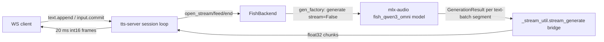

# Task: tts-server — `fish_tts` (Fish Audio S2 Pro) backend

**Status**: Complete — implementation done on `feature/tts-fish-s2pro-backend`; not yet merged (no PR opened)
**Component**: tts-server (backends)
**Assigned to**: Varun Singh
**Priority**: Medium
**Branch**: `feature/tts-fish-s2pro-backend` (off `main` @ `9e98f45`)
**Created**: 2026-08-04

## Objective

Add a `fish_tts` non-streaming TTS backend (`mlx-community/fish-audio-s2-pro`, an mlx conversion
whose provenance from `fishaudio/s2-pro` is **assumed from HF naming, not yet read** — Phase 0 Q6
confirms it — via the already-pinned mlx-audio 0.4.4) using the dia template (segment-level,
`streaming:false`), with tests, justfile smoke recipes, and a cross-backend profiling entry. **No
server CODE changes** — the backend plugs into the existing session loop / `_stream_util` bridge
exactly like every other backend. `docs/protocol.md` (the wire-contract *doc*, not server code)
**does** change: it documents the new `instruct` extra (see Context).

## Context

- mlx-audio 0.4.4 (the pinned version this project already installs) ships the Fish Speech model
  family under `mlx_audio.tts.models.fish_qwen3_omni` (directory name is legacy; the model itself
  loads `mlx-community/fish-audio-s2-pro`) — **no pin bump needed**.
- `generate()` explicitly raises `NotImplementedError` when `stream=True`
  (`fish_speech.py:966-967` in the installed package) — Fish is structurally a **segment-level**
  backend like `dia`, not a sub-segment streamer like voxtral/pocket/qwen3. `capabilities()`
  advertises `streaming: false`, reusing the identical bridge with zero server changes (dia
  precedent).
- **License (assumed, unverified)**: recalled as the Fish Audio Research License — free for
  research/non-commercial use, commercial use requiring a separate agreement from Fish Audio
  (`business@fish.audio`) — but nothing in this repo or the installed mlx-audio package confirms
  this; it is not read from any local source. Phase 0 Q6 is the **sole** source of truth: it must
  fetch and read the license file/card for both `mlx-community/fish-audio-s2-pro` (the conversion
  repo actually used) and `fishaudio/s2-pro` (the assumed source repo), since the two may carry
  different license metadata. Docs (README, smoke README) quote ONLY the Q6-verified text, never
  this recalled bullet. **Correction (Codex adversarial review, 2026-08-05)**: this is NOT the
  first non-permissive-license backend in this repo — `voxtral_tts` already ships under CC-BY-NC
  weights (`docs/protocol.md:135`, README "Backends & licenses"). If Q6 confirms a non-Apache/MIT
  license, the correct framing is "the second backend under restrictive terms, and the first under
  a *research-only* (non-commercial-without-separate-agreement) license, distinct from voxtral's
  CC-BY-NC" — not "the first."
- **Voice cloning scope decision (2026-08-04, user-confirmed)**: `ref_audio`/`ref_text` stay
  **forbidden**, matching the standing v1 decision already recorded against dia/pocket_tts/
  qwen3_tts (`docs/protocol.md:166`: "no voice cloning or style control in v1") — the WS protocol
  has no transport for binary reference audio, and extending it is out of scope for this plan.
  Options considered and rejected: (a) server-side curated reference-voice bundle exposed as named
  `voices()` — no protocol change needed, but adds curated audio assets and a new voices concept
  this backend doesn't otherwise have; (b) full WS protocol extension for client-uploaded audio —
  multi-system scope (protocol.md, server.py, client SDK), far beyond one backend addition. Deferred
  to `## Follow-up Work` below, same as qwen3's `instruct`/cloning follow-up note.
- **`instruct` IS in scope, and this DOES require a `docs/protocol.md` change (user-confirmed
  2026-08-04, resolving a review finding)**: `docs/protocol.md:166` currently states
  "`ref_audio`/`ref_text`/`instruct` are **never** advertised (no voice cloning or style control in
  v1)" — advertising `instruct` for `fish_tts` contradicts that line as written, so Phase 2 amends
  `docs/protocol.md` itself: add `fish_tts`'s extras row, and reword the blanket sentence to scope
  it to "no voice cloning in v1 for any backend; no style control except `fish_tts`'s `instruct`."
  This is a genuine wire-*documentation* change (not a wire-*mechanics* change — the extras
  filtering path is already fully generic, see Architecture Decisions), which is why the Objective
  now says "no server CODE changes" rather than the previous "no protocol changes." `instruct` is a
  plain string (`_build_conversation(instruct=...)` in `fish_speech.py:458-499`) with no
  binary-transport requirement, unlike `ref_audio`/`ref_text`, so it can ride as an advertised extra
  without any WS-protocol *mechanics* change. This is a **new** coercer (`coerce_instruct`) in
  `_extras_util.py` — no prior backend has a string-typed extra. Note: the qwen3 dev-plan record
  gives no transport rationale for forbidding `instruct` there (unlike `ref_audio`/`ref_text`,
  which it explicitly ties to the missing WS transport) — this plan interprets qwen3's blanket
  forbid as scoping conservatism, not a stated technical constraint, and deliberately diverges.
- Inline `[tag]` emotion markup (`[whisper]`, `[laughing]`, etc.) and `<|speaker:N|>` multi-speaker
  tags need **zero backend wiring** — they are ordinary substrings of the `text` the client already
  sends, exactly like dia's `[S1]`/`[S2]` dialogue tags riding inside `plain` text
  (`dia.py:1-35`). Document as usable, not specially validated or advertised as a new capability.
- **Mixed-input hazard (review finding, 2026-08-06): untagged prose preceding the first
  `<|speaker:N|>` tag is silently dropped, never synthesized.** `split_text_by_speaker`
  (`prompt.py:104-123`) regex-splits on the tag pattern; any leading non-tag span hits the
  `else: i += 1` arm and is discarded — e.g. `"Intro sentence. <|speaker:0|>Hi"` loses "Intro
  sentence." with no error, because once turns are non-empty the `[text]` single-batch fallback
  (see below) never fires to rescue the dropped prefix. Q1's gate must add a mixed-input case
  (untagged text before the first tag) to confirm/measure this, and the Phase-2 tag-dialect
  documentation must call out the drop behavior explicitly, not just the cross-backend-dialect
  hazard.
- Fish's `generate()` deletes its `voice` parameter immediately (`del voice, repetition_penalty,
  verbose, kwargs` — `fish_speech.py:964`) — there is no usable voice concept at all, an even
  stronger case than dia's structural voice-discard (dia at least accepts `voice=None`
  positionally; Fish discards unconditionally). `voice_count: 0`, no `voices()` method.
- **Cross-batch coupling is an open question, gate-critical (dia precedent applies) — batching
  premise CORRECTED (Codex adversarial review, 2026-08-05)**: Fish's `_split_generation_text` calls
  `split_text_by_speaker(text)` first (`prompt.py:104-119`), which extracts turns ONLY from
  `<|speaker:N|>`-tagged spans via regex — **plain prose with no speaker tags produces an EMPTY
  turns list**, and `_split_generation_text` then returns `[text]` as a single whole-text batch
  (`fish_speech.py` — `... if turns else [text]`). `group_turns_into_batches(..., max_bytes=
  chunk_length)` only runs, and only ever splits, when `<|speaker:N|>`-tagged turns are present —
  it never splits a plain-prose call regardless of `chunk_length`, and it never splits a single
  oversized tagged turn either (it groups whole turns, never fragments one). **A second, independent
  split trigger exists** (review finding, 2026-08-06): `group_turns_into_batches(turns,
  max_speakers=5, ...)` also splits after 5 turns regardless of byte count (`prompt.py:125-138`) —
  Q1's input-construction note must account for both the byte-based and the turn-count-based
  trigger so a coupling verdict derived from one doesn't silently miss the other. Two consequences
  that correct the plan's original framing: (1) **Q1's gate must construct input using actual
  `<|speaker:N|>` tags** to exercise multi-batch generation at all — a plain-prose seeded A/B/C
  test would trivially show zero coupling because it never leaves a single batch; (2) **a large
  `chunk_length` default CANNOT be used to keep ordinary/single-turn prose "single-batch and
  therefore protected from Q5 truncation"** as the original GATE clause implied — ordinary prose is
  ALWAYS single-batch regardless of `chunk_length`, so the Q5 truncation risk (the `max_tokens=1024`
  ceiling) is entirely independent of the `chunk_length`/coupling question and must be solved on its
  own terms (see Q5, `_MAX_TEXT_CHARS`). After each batch, Fish appends an `assistant` `VQPart(codes)`
  message to the conversation (`fish_speech.py:1007-1015`) — the **next tagged batch's prompt
  includes the previous batch's audio codes as context**. This looks structurally identical to
  dia's cross-segment autoregressive coupling (already documented in
  `[[dia-cross-segment-state]]`-type findings) and MUST be verified with a seeded A/B/C gate using
  multi-turn tagged input before Phase 1, not assumed.
- **Worker-thread `mx.compile` crash-class risk (Codex adversarial review, 2026-08-05)**: Fish's
  `_sample_logits` is wrapped with `@partial(mx.compile, inputs=mx.random.state,
  outputs=mx.random.state)` (`fish_speech.py:361`) — the SAME class of `mx.compile` usage that
  caused qwen3's thread-local `CompilerCache` segfault on daemon-thread exit (qwen3 dev-plan
  Findings: "mlx CompilerCache segfault… `CompilerCache::~CompilerCache` invoked without the GIL by
  pthread TLS cleanup"). Fish's production path drives `generate()` through the same
  `_stream_util.py` daemon-thread bridge qwen3 uses (`tts-synth` worker thread,
  `_stream_util.py:253`), so this is NOT a theoretical risk — it is the same mechanism. Rather than
  wait to rediscover the crash during Phase 1 testing (as qwen3 did), Phase 1 proactively calls
  `mx.disable_compile()` in `FishBackend.start()`, matching qwen3's fix, with a Findings note citing
  this Context bullet as the reason it was applied pre-emptively rather than reactively. Phase 0's
  direct-call gate script does NOT exercise the daemon-thread worker lifecycle (it calls `generate()`
  synchronously, no `_stream_util` bridge), so Phase 0 alone cannot rule this out — the crash class
  only manifests through the production bridge, which is exactly why Phase 1 applies the guard
  proactively instead of relying on Phase-0 gate silence as evidence of safety. **Gate/production
  measurement divergence (review finding, 2026-08-06): the crash-class asymmetry above also implies
  a MEASUREMENT asymmetry the plan doesn't check.** Phase 0's gate calls `generate()` directly
  without `mx.disable_compile()`, while Phase-1 production always runs with it. `_sample_logits` is
  exactly the `mx.compile`-wrapped function being disabled, and `mx.random.state` is threaded
  through that `mx.compile` wrapper — eager vs. compiled execution can change latency and
  potentially the sampled RNG stream, so Q1's seeded A/B/C determinism/coupling verdict and Q2's
  latency numbers are not guaranteed to transfer from gate to production unmodified. Phase 0 must
  either run the gate with `mx.disable_compile()` active (matching production) or run Q1/Q2 both
  ways and record the delta; Q1's determinism verdict is only valid under the production compile
  mode until this is checked.
- `sample_rate` defaults to 44100 in `ModelConfig` (`config.py:65`) — a dataclass default, not a
  repo-confirmed value (same caveat as every prior backend); Phase 0 must record the live value.

## Requirements

- Backend name, extra name, and justfile recipe suffix are all **`fish_tts`** (consistent with the
  `_tts` suffix convention on `voxtral_tts`/`qwen3_tts`, distinguishing from mlx-audio's internal
  `fish_qwen3_omni` package directory name, which is not exposed to clients).
- Default model `mlx-community/fish-audio-s2-pro`, exported as `DEFAULT_FISH_MODEL`.
- Lean-base invariant holds: `import tts_server` and `make_backend("fish_tts", …)` succeed with
  only the lean base installed; `mlx_audio` enters the process only in `start()`. Enforced by a
  dedicated `tests/test_fish_lean.py` — **correction (Codex adversarial review, 2026-08-05)**: not
  literally "every sibling backend has one" under that exact naming; voxtral/pocket/dia/qwen3 use
  `test_<name>_lean.py`, but kokoro's lean-import coverage lives in differently-named files
  (`test_kokoro_lazy_import.py`, `test_kokoro_language_advertise.py`, `.github/workflows/test.yml:
  53-58`). `fish_tts` follows the voxtral/pocket/dia/qwen3 `test_<name>_lean.py` naming, not
  kokoro's.
- Non-streaming backend contract (dia template): `capabilities()["streaming"] is False`;
  segment-level `GenerationResult`s flow through the shared `_stream_util.stream_generate` bridge;
  `sample_rate` read from `model.sample_rate` in `start()` before warmup (never hardcode 44100 —
  the gate records the real value).
- No voice concept: `voice_count: 0`, no `voices()` method, `open_stream(voice=…)` accepts and
  discards the argument (dia's decision-#1 pattern — the discard is structural, not merely
  test-enforced: the stream class takes no `voice` parameter to forward it through).
- `ref_audio`/`ref_text` are real `generate()` kwargs but **forbidden** — never advertised, never
  forwarded, enforced by the allow-list-only extras copy (dia decision-#2 pattern) plus a
  negative-guard lean test.
- `instruct` **is** advertised as a new string extra: `coerce_instruct` (net-new, generic
  str-type-check logic in `_extras_util.py`) validates it's a `str`, rejects non-str types
  (including `bool`/`bytes`), and **rejects** (does not silently clamp/truncate) a string longer
  than a length bound — a truncated instruction silently changes what the model is told to do,
  unlike a clamped `temperature`/`top_p`/`top_k`, where any in-range value is still a valid sample
  knob (user-confirmed 2026-08-04, resolving a Requirements/test-list contradiction a review
  flagged). The length bound itself (proposed 500 chars, gate-informed) is a **fish-specific**
  constant kept in `fish_tts.py`, NOT the shared `_extras_util.py` module — `_extras_util.py`'s
  docstring frames its bounds as cross-backend DoS/correctness constants, and a fish-calibrated
  number has no business being a silent default for some future second `instruct`-advertising
  backend. `coerce_instruct(raw, max_len)` takes the bound as a parameter; only the generic
  str-type/non-str-rejection logic is shared. An empty string after stripping leading/trailing
  whitespace is **omitted** from the forwarded extras (consistent with the sibling convention that
  unset extras are omitted, not forwarded as `None`/`""` — see `tests/test_qwen3_lean.py:318-324`).
  **Mechanism (review finding, 2026-08-06): `coerce_instruct` returns `str | None`** — `None` for
  the valid-but-empty-after-strip case — and `open_stream`'s copy loop (unlike dia's/qwen3's
  unconditional `effective[key] = coerce(raw)`) must skip a `None` coercion result rather than
  assign it, since `_extras_util.py`'s own dispatch (`validate_extras`) only skips `None` *before*
  calling the coercer, not after. This is a deliberate, documented departure from the numeric
  coercers' return convention (they always return a forwardable value or raise) and needs a lean
  test covering `""`/`"  "` passing `validate_extras` but absent from the recorded `generate()`
  kwargs.
- Sampling extras: `temperature`, `top_k`, `top_p`, `instruct` (order matches the qwen3/voxtral
  convention for the shared numeric trio, with `instruct` appended — order matters, advertised
  order is protocol-asserted, mirrors `_EXTRA_COERCERS` dict order per existing backends).
- **`speed` scope decision (Codex adversarial review, 2026-08-05, resolving a silent omission)**:
  Fish's `generate()` accepts a real `speed: float = 1.0` kwarg (`fish_speech.py:959`, applied via
  `_adjust_speed`), but it is **deliberately NOT advertised** in v1 — `speed` support is not shared
  cross-backend infrastructure (`_coerce_speed` is private to `kokoro.py`, not in `_extras_util.py`),
  and adding it here would require either duplicating a coercer or extracting one, both out of scope
  for a single-backend addition. This is a named scope decision, not a silent gap — tracked in
  `## Follow-up Work`.
- Phase 0 is a **hard gate**: cross-batch coupling (dia-style A/B/C seeded comparison), sample
  rate, license file contents, and truncation/token-budget behavior on long text must be verified
  on this machine before backend code is written. A falsified assumption triggers a re-plan.
- Tests mirror the sibling-backend two-layer pattern: `tests/test_fish_backend.py` (mlx-gated) +
  `tests/test_fish_lean.py` (lean, CI-runnable).
- justfile gains `smoke-fish_tts` and `smoke-multiconn-fish_tts` recipes; the smoke shell scripts'
  hardcoded backend allowlists MUST be extended in the same commit (required edit, not
  conditional, per qwen3 precedent).
- **Backend-set drift invariant** (enforced by `tests/test_justfile_recipes.py`): argparse
  `--backend` choices == README port-convention table == `render_tts_plist._BACKEND_RE` ==
  justfile `_resolve` map. Canonical port assignment: **9265** (next in the +100 sequence
  8665…9165).
- Profiling: `rtf_benchmark.py --backend fish_tts` run added to the comparison table in
  `scripts/profiling/README.md` (TTFB/RTF; peak memory measured in the Phase-0 gate, matching
  qwen3's discovery that the bridge discards `GenerationResult.peak_memory_usage`).
- Docs updated alongside code: README backend + port tables (with the **non-permissive license
  called out explicitly, if Q6 confirms one**, unlike every sibling), AGENTS.md backend list,
  `tests/smoke/README.md` weights/license note quoting the Phase-0-Q6-verified license text
  verbatim + commercial-use contact — never the recalled Context bullet, which is explicitly
  unverified.

## Review Focus

- **Cross-batch coupling gate completeness**: does the Phase-0 gate actually falsify/confirm
  whether batch 2's audio is affected by batch 1's content, using **`<|speaker:N|>`-tagged input**
  (the only way to force multiple batches — see Context correction, 2026-08-05), and does the
  resulting design decision get carried correctly into Phase 1? Separately: is the Q5 truncation
  risk (which affects ALL text, tagged or not — `max_tokens` is a per-**batch** ceiling, corrected
  2026-08-06: ordinary prose is always exactly one batch, so it still sees exactly one 1024-token
  budget, but tagged multi-batch input gets one 1024-token budget PER batch, a larger effective
  total) verified on its own terms rather than assumed mitigated by `chunk_length`?
- **`ref_audio`/`ref_text` negative guard**: same bar as dia/pocket/qwen3 — provably unable to
  reach `generate()` even if injected via `open_stream` extras (lean spy-model test).
- **`instruct` as a net-new string extra**: is `coerce_instruct` actually exercised by
  `validate_extras`, and does it correctly reject non-str / oversized input? Is the length bound
  justified by gate data, not guessed? Note the numeric coercers are NOT uniformly "reject
  out-of-bound" — `temperature`/`top_k` clamp both bounds, `top_p` clamps only the upper bound and
  REJECTS non-positive values (`_extras_util.py:74-90`) — `coerce_instruct`'s reject-on-oversized
  behavior parallels `top_p`'s asymmetric reject, not a uniform coercer pattern.
- **Voice discard is structural, not incidental**: `open_stream` must not construct or forward any
  `voice`-shaped kwarg — verify no code path threads a client-supplied voice into `generate()`.
- **License documentation accuracy**: does the smoke README / main README note quote the actual
  license text discovered in the gate (not an assumption), and is the commercial-use restriction
  visible before a user reaches for this backend expecting Apache/MIT-equivalent terms?
- **Lean-base invariant**: no module-load import of `mlx_audio`/`numpy` in the new module.
- **Drift invariant**: argparse == README port table == `_BACKEND_RE` == justfile `_resolve`.

## Implementation Checklist

### Phase 0: Model verification gate (dia/qwen3 precedent)

**Impl files:** `tests/smoke/fish_phase0_gate.py`
**Test files:** `tests/smoke/fish_phase0_gate.py`
**Test command:** `uv run --extra dia python tests/smoke/fish_phase0_gate.py`

Standalone script (mlx-audio direct, no server) that downloads the model once and answers, with
printed PASS/FAIL per question. `--extra dia` supplies mlx-audio 0.4.4 without needing the
`fish_tts` extra to exist yet (any existing mlx extra works; the `fish_tts` extra is created in
Phase 2).

- **Q1 — cross-batch coupling**: seeded A/B/C comparison (dia precedent) — **input MUST use
  `<|speaker:N|>`-tagged turns** (e.g. `<|speaker:0|>...\n<|speaker:1|>...\n<|speaker:0|>...`), long
  enough across enough turns to force `group_turns_into_batches` to split at `chunk_length` — plain
  untagged prose never leaves `_split_generation_text`'s single-batch `[text]` fallback (see Context
  correction, 2026-08-05) and would trivially show zero coupling without exercising the mechanism at
  all. Does batch 2's waveform stay byte-identical whether batch 1's tagged text is varied or not?
  Are two separate `generate()` calls (across commits) independent? Record the decision this drives:
  accept coupling as designed-in for tagged multi-turn input (document it, matches dia) — note this
  decision has NO bearing on ordinary/untagged prose, which is always single-batch regardless of
  `chunk_length`.
- **Q2 — latency + memory**: measure TTFB (first `GenerationResult` wall time) and full-utterance
  RTF for a short and a ~15s-equivalent utterance. Record peak memory via
  `GenerationResult.peak_memory_usage` / `mx.get_peak_memory()` — the Phase-3 profiler cannot see
  it (bridge strips everything but PCM, qwen3/dia precedent).
- **Q3 — sample rate + voice/language surface**: confirm `model.sample_rate` actually reported
  (dataclass default is 44100 — verify, don't assume). Confirm `generate()` truly ignores `voice`
  (already source-verified via `del voice` — gate confirms no observable effect empirically too).
  No language knob exists in `generate()`'s signature — confirm and record `capabilities()`
  should advertise a static `["en"]`-equivalent list (or whatever the model card claims,
  cross-checked).
- **Q4 — `instruct` behavior**: with and without an `instruct` string, does generation succeed
  cleanly in both cases (per the earlier "what happens if none are provided" investigation —
  confirmed source-level as a no-op default, gate confirms empirically)? Test a very long
  `instruct` string to inform the length-reject bound in `coerce_instruct` (oversized `instruct`
  is rejected, not truncated — see Requirements).
- **Q5 — token budget / truncation risk**: `max_tokens` defaults to 1024 in `generate()`
  (`fish_speech.py:953`) — measure how much audio that caps out at, and whether long/repetitive
  text degenerates the way qwen3's CustomVoice did (silent mid-utterance truncation was qwen3's
  root cause for `_MAX_TEXT_CHARS`). This applies to ORDINARY prose too, not just tagged multi-batch
  input — **corrected 2026-08-06: `max_tokens` is actually a per-BATCH ceiling**
  (`max_new_tokens=max_tokens` is passed into `_generate_codes_for_batch` inside Fish's per-batch
  loop), not a flat per-`generate()`-call ceiling as previously stated. Ordinary prose is always
  exactly one batch (see Q1 correction, 2026-08-05), so it still sees exactly one 1024-token budget
  and `chunk_length` still provides zero protection there — but tagged multi-batch input gets one
  1024-token budget per batch, a larger effective total than a prose-calibrated cap assumes. Measure
  the per-batch cap, and note that a `_MAX_TEXT_CHARS` derived from ordinary-prose measurement is
  conservative (not exact) for tagged multi-batch input.
- **Q6 — license + upstream model-card figures**: fetch/read the HF repo's license file/card for
  `mlx-community/fish-audio-s2-pro` and `fishaudio/s2-pro` (the source repo); record the exact
  license text and the commercial-use contact into `## Findings` for the README/smoke-README note.
  **Also record the upstream model-card's performance/scale claims here** (training hours,
  language count, or equivalent) — Phase 3's comparison table and the Acceptance Criteria both cite
  "Q6-recorded figures," so Q6 is the only place these are actually captured; do not leave this
  data uncaptured and expect Phase 3 to source it independently.
- Also record: audio sanity (no NaN, not clipped, audible speech written to WAV for perceptual
  check, including one `[tag]`-marked utterance to confirm inline markup is at least accepted
  without erroring).

**GATE**: Q1 shows coupling that produces audibly-broken batch-2 output on tagged multi-turn input
(not just difference, but actual quality degradation) → re-plan the multi-speaker-tag handling or
add a stitching workaround (this GATE does NOT apply to ordinary prose, which never reaches
multi-batch — see Q1 correction). **Machine-vs-perceptual split (review finding, 2026-08-06):** Q1's
output has two distinct halves — byte-identity between batch-2 waveforms across varied vs. fixed
batch-1 input is machine-assertable (script prints PASS/FAIL on this directly), but "audibly-broken
... quality degradation" is a perceptual judgment the gate script cannot assert. Q1 should report
the byte-identity verdict as the primary machine-checked PASS/FAIL, with the quality-degradation
call recorded as a separate human-listen checkbox in `## Findings`; the GATE triggers on the
human-listen judgment only when byte-identity has already failed. Q3 surprises (non-44100 rate,
unexpected voice sensitivity) →
update Phase 1 defaults before proceeding. Q5 truncation on realistic prose (independent of Q1/
`chunk_length` — applies to ALL text) → set `_MAX_TEXT_CHARS` conservatively, mirroring qwen3's
fix-loop lesson rather than repeating it. Findings land in `## Findings` below the marker.

### Phase 1: Backend module + unit tests (mlx-gated + lean)

**Impl files:** `tts_server/backends/fish_tts.py, tts_server/backends/_extras_util.py, tts_server/backends/_introspect_util.py, tts_server/backends/dia.py, tests/test_import_safety.py, .github/workflows/test.yml`
**Test files:** `tests/test_fish_backend.py, tests/test_fish_lean.py`
**Test command:** `uv run --extra dia pytest tests/test_fish_backend.py tests/test_fish_lean.py -v`

**(Corrected, Codex adversarial review 2026-08-05 — extras-preserving invocation required, not
bare `uv run`.)** `tests/smoke/run_multiconn.sh:40` documents this in the codebase itself: "A plain
`uv run` re-syncs and strips the kokoro extra mid-run; pin `--no-sync`." The qwen3 dev-plan records
the identical fix for its own Phase-0 command (`docs/dev_plans/20260703-...:508`). Without
`--extra dia`, a bare `uv run pytest ...` risks re-syncing to the lean base first, at which point
`test_fish_backend.py`'s module-level `pytest.importorskip("mlx_audio")` silently SKIPS the entire
mlx-gated suite instead of running it — a false-green, not a failure. `--extra dia` supplies
mlx-audio 0.4.4 (the `fish_tts` extra doesn't exist until Phase 2, same reasoning as the Phase-0
gate command).

- New `FishBackend` derived from the dia template (`dia.py`): lazy `load()` in `start()`,
  `sample_rate` from `model.sample_rate` pre-warmup (never hardcoded, gate-verified value),
  warmup synth, `open_stream()` returning a `_FishStream` whose `_gen_factory` drains
  `model.generate(text, stream=False, **extras)` through the shared bridge — `stream` is passed
  explicitly (not omitted) as documentation that this is a deliberate non-streaming choice, not an
  oversight (Fish's default is already `False`, so this is belt-and-suspenders).
- **`mx.disable_compile()` in `start()` (Codex adversarial review, 2026-08-05, proactive fix — see
  Context "Worker-thread `mx.compile` crash-class risk")**: called immediately after `load()`,
  before warmup, mirroring qwen3's fix for the identical `CompilerCache` thread-exit segfault class.
  Fish's `_sample_logits` is `mx.compile`-wrapped (`fish_speech.py:361`) and runs on the same
  `_stream_util.py` daemon-thread bridge qwen3 does. Applied pre-emptively rather than discovered
  reactively during Phase 1/2 testing (qwen3's actual history).
- `_FishStream` has **no `voice` parameter** (dia decision-#1 pattern, even stronger here since
  Fish's `generate()` discards `voice` unconditionally) and never builds `ref_audio`/`ref_text`
  (decision-#2 pattern) — only advertised, coerced extras splat into `generate()`.
- Net-new `coerce_instruct(raw, max_len)` in `_extras_util.py` (generic: `str`-type check,
  `bool`/`bytes` rejection, whitespace-strip, oversized-string **rejection** — not truncation, see
  Requirements); `fish_tts.py` defines its own `_INSTRUCT_MAX_LEN` constant (gate-informed,
  proposed 500) and passes it in, keeping the fish-specific bound out of the shared cross-backend
  module. `validate_extras` already skips `None` via `.get()`, so `None`-passed-explicitly is not a
  distinct case. Coverage lands in `tests/test_fish_lean.py` (per the codebase's existing indirect
  pattern — the numeric coercers have no dedicated `_extras_util` test file either, they're tested
  through each backend's own lean suite; no new bare test file for `_extras_util.py`).
- `_EXTRA_COERCERS = {"temperature": ..., "top_k": ..., "top_p": ..., "instruct": ...}` — dict
  order load-bearing (advertised extras order is protocol-asserted, per every sibling; matches the
  qwen3/voxtral numeric-trio order with `instruct` appended, not a gratuitously different order).
  **Arity note (review finding, 2026-08-06): `coerce_instruct(raw, max_len)` is a two-arg callable,
  but every consumer of this dict — `validate_extras` (`_extras_util.py:106`, `coerce(raw)`) and the
  per-backend `open_stream` copy loop (`dia.py:357`/`qwen3_tts.py:611-612`, same one-arg call) —
  invokes coercers with exactly one argument.** The `instruct` entry must therefore be a bound
  single-arg callable, e.g. `functools.partial(coerce_instruct, max_len=_INSTRUCT_MAX_LEN)` or a
  module-level closure in `fish_tts.py` — do not widen `validate_extras`'s calling convention or
  fork the copy loop to accommodate a two-arg coercer.
- `capabilities()`: `streaming: False`, `voice_count: 0` (no `voices()` method), `text_formats:
  ["plain"]` (inline `[tag]`/`<|speaker:N|>` markup rides inside `plain`, undocumented on the
  wire — dia precedent for dialogue tags), `languages` static (gate-informed), `extras:
  ["temperature", "top_k", "top_p", "instruct"]`, `ideal_words`/`max_text_chars` gate-informed.
- **Net-new shared helper** `tts_server/backends/_introspect_util.py` (stdlib-only, `inspect`-based
  — same lean-import discipline as `_extras_util.py`): extracts the `generate()`
  signature-verification guard currently duplicated nowhere-else-but-about-to-be-duplicated. dia's
  own docstring says "If this guard is ever needed by a second backend, lift it into a shared
  helper rather than copying it" (`dia.py:269-275`) — fish is that second backend, so this phase
  refactors `dia.py` to call the shared helper (`verify_generate_signature(model, expected_params,
  backend_name)` or similar) instead of keeping its private copy, and `fish_tts.py`'s
  `start()` calls the same helper — Fish's `generate()` carries the live voice-cloning channel
  (`ref_audio`/`ref_text`) and the new `instruct` surface, so the same "why introspect at all"
  rationale applies here too. **Regression coverage (Codex adversarial review, 2026-08-05)**: no
  test exercised `_verify_generate_signature` before this refactor (`test_dia_backend.py` doesn't
  exist, `test_dia_lean.py` has no coverage of it either), so this is net-new testing, not a
  preserved-behavior verification. Add a small model-agnostic unit test in a lean location for
  `_introspect_util.py` itself (spy object with a matching/mismatching signature, asserting the
  match/warn-log behavior), and confirm `tests/test_dia_lean.py` still passes unmodified after the
  refactor (dia's existing lean suite is the closest thing to a regression check available).
- `tests/test_fish_backend.py` (mlx-gated) follows the mlx-gated pattern used by
  `test_qwen3_backend.py`/`test_pocket_backend.py` (module-scoped `started_backend`,
  `pytest.importorskip("mlx_audio")`, NaN/clip test, hello-rate test via `tests/_helpers.py`) —
  **not** `test_dia_backend.py`, which does not exist (dia has no mlx-gated test file, only
  `test_dia_lean.py`; fish gets a dedicated mlx-gated file since, unlike dia, it has enough
  fish-specific behavior — `instruct`, cross-batch coupling — to warrant one). Adds a segment-level
  generation test and an `instruct`-present smoke case. Imports `FishBackend` **directly** (not via
  `make_backend`), so the Phase-1 commit stays green before the Phase-2 registry branch exists.
- `tests/test_fish_lean.py` (no mlx) mirrors `test_dia_lean.py`, **fully landing in this phase**
  (resolving a review finding that left the commit state ambiguous): subprocess lean-import check;
  `make_backend("fish_tts")` construction and argparse-choice-membership cases marked
  `xfail(strict=False, reason="registry/CLI wiring lands in Phase 2")` — **the `DEFAULT_FISH_MODEL`
  dual-path resolution assertion below is also marked `xfail(strict=False, ...)` in this same set**
  (review finding, 2026-08-06: it depends on both Phase-2 wirings — `__main__.py`'s
  backend→default-model map AND `make_backend`'s fallback — so it fails hard, not skips, in the
  lean CI job at the Phase-1 commit if left unmarked). The xfail markers are
  **removed** in Phase 2 once the registry exists (tracked there, not re-added here); `streaming:
  False` caps shape; `caps["extras"] == ["temperature", "top_k", "top_p", "instruct"]`; **explicit
  no-`voices()`-method assertion** (dia's `test_no_voices_method_so_voice_set_stays_empty`
  pattern — the other half of `voice_count:0`); **`sample_rate == 0` pre-`start()`** (dia's
  `test_sample_rate_zero_pre_start` pattern); **`DEFAULT_FISH_MODEL` resolves identically through
  BOTH independent paths** (Codex adversarial review, 2026-08-05: importability alone doesn't prove
  this) — `tts_server/__main__.py`'s backend→default-model lookup function AND
  `make_backend("fish_tts")`'s `model or DEFAULT_FISH_MODEL` fallback must both resolve to the same
  constant, asserted explicitly, not just imported; **per-backend numeric-coercer coverage** (non-finite/bool rejection, clamp-to-bounds via
  `validate_extras`, mirroring `test_dia_lean.py`/`test_qwen3_lean.py`'s own per-backend numeric
  assertions even though the coercers are shared); spy-model test asserting **both** `voice` AND
  `language` (`open_stream(voice="x", language="en", extras=...)`) never appear in the recorded
  `generate()` kwargs (language discard was previously asserted only in the sequence diagram, not
  tested); the `ref_audio`/`ref_text` forbidden-kwargs negative guard; `coerce_instruct` cases
  **exercised via `validate_extras`** (matching the numeric-coercer wording above, not called
  directly — review finding, 2026-08-06): non-str rejection incl. bool/bytes, oversized-string
  rejection, empty-after-strip → omitted from forwarded extras — not forwarded as `""`; a lean
  extras-merge test asserting a string
  `instruct` value survives the `open_stream`/`_gen_factory` extras path semantically intact
  end-to-end — i.e. unchanged through that specific post-coercion path, where the value has already
  been whitespace-stripped by `coerce_instruct` (clarified 2026-08-06). The extras filtering
  mechanism is generic/backend-agnostic, but no test previously exercised a *string*-typed value
  through it — `tests/test_capabilities_extras.py` only covers numeric/short values.
- **`tests/test_import_safety.py`**: add `tts_server.backends.fish_tts` **and
  `tts_server.backends._introspect_util`** (review finding, 2026-08-06 — the net-new shared module
  also introduced in this phase; precedent for explicitly listing new shared modules from their
  introducing commit is mixed, but the plan's own stated rationale below argues for it) to
  `_TTS_MODULES` in **this phase** (not Phase 2) — this is where the module is introduced, matching
  the recorded dia/qwen3 precedent ("Listed explicitly ... from the commit that introduces it",
  `tests/test_import_safety.py:36-40`; leaving it for Phase 2 would ship one commit with an
  unguarded lean-import invariant).
- **`.github/workflows/test.yml`**: add `tests/test_fish_lean.py` to the `test-lean` job's allow-list
  in **this phase**, in the same commit that creates the file — the workflow's own comment states
  "each phase that adds a lean test extends this list in the same commit"
  (`.github/workflows/test.yml:14-16`); deferring this to Phase 2 would mean the file exists but CI
  silently never runs it.
- **Conditional truncation-tripwire task** (decided by Phase 0 Q5): if Q5 finds that realistic
  prose caps out against `max_tokens=1024` before completing (qwen3's CustomVoice silent
  mid-utterance truncation precedent), implement a token/duration ceiling tripwire mirroring
  qwen3's fix — raising a `FishTruncationError` that propagates through the bridge so the server
  emits `response.failed` (`BACKEND_ERROR`) instead of a clean `completed` with missing audio — with
  two lean tests mirroring `tests/test_qwen3_lean.py:360-394` (`test_truncation_tripwire_...`,
  `test_truncated_segment_fails_response_not_silent_success`). If Q5 finds no realistic risk at the
  chosen `_MAX_TEXT_CHARS`, record that finding and skip the tripwire (do not build unneeded guard
  code).
- **Cancel/`wait_closed` claim corrected (Codex adversarial review, 2026-08-05)**:
  `tests/test_streaming_and_cancel.py` is NOT backend-agnostic — it constructs `ToneBackend`
  directly and tests the SESSION-LOOP's cancel/streaming contract, not any specific backend's
  `TTSStream.cancel()`/`wait_closed()` implementation. It exercises the shared bridge machinery
  Fish also uses (giving genuine partial coverage), but does not exercise `_FishStream`'s own
  cancel/`wait_closed` logic — dia has the same gap today (no dedicated test either), which this
  plan does not fix retroactively, but does not repeat: `tests/test_fish_lean.py` adds a direct
  spy-model test of `_FishStream.cancel()`/`wait_closed()` semantics (external-cancel flag set,
  `wait_closed()` blocks until the worker-done event, mirroring the Metal-lock-hold rationale in
  `dia.py:160-172`) rather than relying solely on the ToneBackend-level session suite.

### Phase 2: Wiring — registry, CLI, extra, justfile, smoke scripts, renderer, protocol, docs

**Impl files:** `tts_server/backends/__init__.py, tts_server/__main__.py, pyproject.toml, uv.lock, justfile, scripts/render_tts_plist.py, tests/smoke/run_smoke.sh, tests/smoke/run_multiconn.sh, .github/workflows/test.yml, docs/protocol.md, README.md, AGENTS.md, tests/smoke/README.md`
**Test files:** `tests/test_fish_lean.py`
**Test command:** `uv sync --extra fish_tts && uv run --no-sync pytest tests/ -q`
**Validation cmd:** `just smoke-fish_tts`

**(Corrected, Codex adversarial review 2026-08-05.)** An explicit `uv sync --extra fish_tts`
followed by `--no-sync` guarantees the just-created extra is actually installed when the full
suite runs, rather than relying on bare `uv run`'s ambient re-sync behavior — same rationale as
Phase 1's test command fix and `tests/smoke/run_multiconn.sh:40`'s documented `--no-sync` pin.

All of the following are **one atomic unit** — the smoke scripts auto-run
`uv sync --extra "$BACKEND"`, so the extra, the allowlists, the recipes, and the registry must
land in the same commit or `just smoke-fish_tts` is red at every intermediate point (qwen3
precedent). **Explicit atomic-set enumeration (review finding, 2026-08-06 — the prose above reads
as exhaustive but omitted drift-coupled sites)**: `tests/test_justfile_recipes.py`
(`test_readme_table_covers_exactly_the_argparse_backends`, lines 93-138) asserts set-equality
across argparse `--backend` choices, the README port-convention table, `_BACKEND_RE`, and the
justfile `_resolve` map, and runs in the lean CI job on every commit — so the atomic-commit unit
must also include the **README port-table row (9265)**, the **argparse `--backend` choices**, and
**`scripts/render_tts_plist.py`'s `_BACKEND_RE`**, alongside the registry/extra/recipes/allowlists
below and the `just tts-status` case-arm. The remaining docs (protocol.md, AGENTS.md, smoke README,
capabilities section) can safely trail in a follow-up commit; the port table cannot.
`tests/test_import_safety.py` and the `test-lean` CI allowlist entry are **not** in
this phase — both landed in Phase 1 with the module/test file they guard (resolving a review
finding that had them misordered into Phase 2):

- `make_backend` branch for `"fish_tts"` (lazy import, `model or DEFAULT_FISH_MODEL`, same
  comment discipline as siblings).
- `tts_server/__main__.py`: add `fish_tts` to the argparse `--backend` choices and to the
  backend→default-model resolution map.
- **Remove the `xfail(strict=False)` markers** on `test_fish_lean.py`'s `make_backend`/argparse
  dual-wire cases now that the registry/CLI wiring above exists — these cases must now pass for
  real, not merely stop being skipped.
- `pyproject.toml` extra: `fish_tts = ["websockets>=13.0", "mlx-audio==0.4.4"]` (verify no bespoke
  dependency is needed for the fish codec/tokenizer via `uv sync --extra fish_tts` — Explore could
  not confirm this without inspecting the installed package's fish backend module; if the
  `fish_s1_dac` codec or `FishTokenizer` pull in something beyond mlx-audio's own transitive deps,
  add it here); sync `uv.lock`.
- justfile: `smoke-fish_tts` + `smoke-multiconn-fish_tts` recipes AND the `_resolve` map entry
  (`pipecat.tts-server.fish_tts` / `127.0.0.1` / `9265`, plus the error-message "valid:" list).
  **`just tts-status`'s backend case-arm** (`justfile:195-205`, Codex adversarial review 2026-08-05)
  ALSO needs `fish_tts` added to its `tone|kokoro|voxtral_tts|pocket_tts|dia|qwen3_tts)` pattern —
  a distinct site from `_resolve`; without this, `just tts-status fish_tts` falls through to the
  case's default arm and is misinterpreted as a socket path rather than resolved to its canonical
  host:port. **Note (review finding, 2026-08-06): this case-arm is a fifth hardcoded backend list
  sitting OUTSIDE `tests/test_justfile_recipes.py`'s drift invariant** — the next backend addition
  must still remember to update it by hand, with no test catching an omission. Out of scope to fix
  here (would mean extending the drift test's coverage), but named explicitly so it isn't mistaken
  for a covered site.
- `tests/smoke/run_smoke.sh`: add `fish_tts` to the backend allowlist, the `IS_MLX` list, and a
  `fish_tts` verify branch — **corrected (Codex adversarial review, 2026-08-05)**: NOT "mirroring
  dia's non-streaming latency check," which does not exist — `run_smoke.sh:190` explicitly SKIPS
  `latency_check` for dia ("dia decodes at RTF≈2.0"). The fish verify branch is net-new: it
  **explicitly asserts `hello.audio.rate == <Phase-0-gate-verified value>`** (the named test owner
  for the "hello advertises the gate-verified model rate" acceptance criterion; the lean suite must
  NOT assert the concrete rate value, mlx-gated/on-host only), and separately decides — from Q2's
  measured RTF — whether a `latency_check` call is warranted for fish or should be skipped like
  dia's, rather than assuming either way. `tests/smoke/run_multiconn.sh`: extend the allowlist/
  extra-install list.
- `scripts/render_tts_plist.py`: extend `_BACKEND_RE` and the human-readable backend list.
- **`.github/workflows/test.yml` macOS smoke job**: add `import tts_server.backends.fish_tts as f`
  (and its `DEFAULT_FISH_MODEL` print) to the hardcoded import heredoc (`:128-143`) — this is a
  distinct list from the lean-job allowlist (already handled in Phase 1) and from
  `tests/test_import_safety.py`; without this edit, `--all-extras` installs the `fish_tts` extra
  but the macOS job never imports the module, silently breaking the AGENTS.md invariant that this
  job "verifies every backend extra resolves and its module imports."
- **`docs/protocol.md`** (user-confirmed 2026-08-04, resolving a Critical review finding that
  `instruct` contradicted the existing "never advertised" line without amending the doc that states
  it): add `fish_tts`'s row to the §6 per-backend extras enumeration
  (`["temperature","top_k","top_p","instruct"]`), and reword the `docs/protocol.md:166` sentence
  from "`ref_audio`/`ref_text`/`instruct` are never advertised (no voice cloning or style control in
  v1)" to something like "`ref_audio`/`ref_text` are never advertised by any backend (no voice
  cloning in v1); `instruct` is advertised only by `fish_tts` (no other backend offers style
  control)." **Also update §6's "Shipped backends" prose inventory** (`docs/protocol.md:134-139`,
  Codex adversarial review 2026-08-05) — a SEPARATE list from the extras enumeration table that
  currently names every backend with its streaming/license summary; add `fish_tts` there too, or
  the doc becomes internally inconsistent (extras table knows about fish_tts, the prose inventory
  doesn't). **Generalize the tag-dialect section (2026-08-05, user-requested)**: `docs/protocol.md`
  §6 already documents dia's `[S1]`/`[S2]` in-text dialogue tags as "Option A — no server-side
  change" (`docs/protocol.md:170-190` — server never parses tags, dialect lives purely in client
  convention, `text_formats` stays `["plain"]`, Option B is the deferred fail-loud upgrade). Extend
  that SAME section (don't fork a fish-only copy) to also cover fish's dialect: `<|speaker:N|>`
  multi-speaker tags (**NOT the same syntax as dia's `[S1]`/`[S2]`** — different backends, different
  dialects, both riding inside the same undocumented `plain` payload) and `[tag]` inline emotion
  markup (`[whisper]`, `[laughing]`, etc. — dia has no equivalent). State explicitly that a client
  must know which backend it is targeting before choosing a tag dialect; the server cannot
  disambiguate or reject a wrong-dialect tag (same "Option A accepted cost" as dia — e.g. a fish
  `<|speaker:1|>` tag sent to kokoro would be read aloud literally, not interpreted). Note in this
  same edit that `examples/pipecat_tts_service.py` sends none of these tags today (verified
  2026-08-05) — using them is a caller-side text-authoring decision, not adapter behavior; if
  first-class pipecat support is wanted later, track it as a separate follow-up (adapter would need
  per-backend dialect knowledge, not a shared code path, since the two dialects are incompatible).
- Docs: README backend table row + **port-convention table row (9265)**, with the license column
  explicitly noting "Fish Audio Research License (non-commercial; commercial requires separate
  agreement)" — **wording sourced verbatim from the Phase-0 Q6 gate finding, never pre-written
  here** — rather than reusing the Apache/MIT shorthand every sibling row uses; note voxtral_tts is
  ALSO non-permissive (CC-BY-NC) — fish is not the repo's first, so don't frame it that way (see
  Context correction, 2026-08-05). AGENTS.md backend list. `tests/smoke/README.md` license note
  quoting the gate-verified license verbatim.
- **New `### fish_tts capabilities (as shipped)` README section (2026-08-05, user-requested)**,
  mirroring the existing `### dia capabilities (as shipped)` section (`README.md:302-329`) —
  same shape (prose intro + capabilities table + a callout box), but this is deliberately an
  **agent-facing reference**, not just a protocol summary: an LLM-driven caller (e.g. a pipecat
  agent composing the text it sends) needs the actual tag vocabulary inline to follow it, not just
  a pointer. Include:
  - The `<|speaker:0|>`/`<|speaker:1|>`/... multi-speaker tag syntax, with one example, and an
    explicit callout that this is **NOT dia's `[S1]`/`[S2]` syntax** — a caller must pick the right
    dialect for the backend it targets.
  - **The example `[tag]` emotion/expression list from the bundled README** (corrected 2026-08-06:
    not a "full verbatim vocabulary" — the source README itself frames these as "Examples include"
    of "free-form textual descriptions for open-ended expression control," i.e. the mechanism is
    open-ended and arbitrary bracketed descriptions may also work, untested; the 34 tags below match
    the README's example list verbatim) (source: the installed mlx-audio package's
    `fish_qwen3_omni/README.md`, "Fine-Grained Inline Control" section — verified 2026-08-05,
    re-verify against the Phase-0 Q6 gate run since this is a bundled package doc, not a live HF
    fetch): `[pause]` `[short pause]` `[emphasis]` `[laughing]` `[laughing tone]`
    `[chuckle]` `[chuckling]` `[tsk]` `[singing]` `[excited]` `[excited tone]` `[interrupting]`
    `[volume up]` `[volume down]` `[loud]` `[low volume]` `[low voice]` `[echo]` `[angry]`
    `[sigh]` `[whisper]` `[screaming]` `[shouting]` `[surprised]` `[shocked]` `[delight]` `[sad]`
    `[moaning]` `[exhale]` `[inhale]` `[panting]` `[audience laughter]` `[with strong accent]`
    `[clearing throat]`.
  - A link to the upstream source (the `mlx-community/fish-audio-s2-pro` model card / Fish Audio's
    own S2 Pro documentation) as the authoritative, potentially-more-current reference, so the
    README list doesn't silently drift from upstream if Fish Audio adds more tags later.
  - The same "Option A accepted cost" framing as dia's section: these tags are plain substrings the
    server never parses; a fish-dialect tag sent to a non-fish backend is read aloud literally, not
    interpreted.
  - Note explicitly (per the earlier client-facing Q&A, 2026-08-05) that `instruct`
    (a separate advertised extra, not an in-text tag) is the OTHER style-control surface fish
    offers, and is documented in its own capabilities-table row, not this tag list.
  - **Note the `instruct`-vs-`[tag]` precedence is undefined and model-determined** (client-facing
    Q&A, 2026-08-05): the server performs no arbitration between `text` (with any inline `[tag]`s)
    and `instruct` — it forwards both to `generate()` **unmodified apart from whitespace-stripping
    of `instruct`** (corrected 2026-08-06: `coerce_instruct` strips leading/trailing whitespace, so
    "unmodified" oversold a byte-identity guarantee the plan itself doesn't make; the model may also
    re-strip/template `instruct` and, per the mixed-input finding above, drop untagged prose that
    precedes a tag — neither of which the server controls). What happens when
    they conflict (e.g. `instruct: "speak calmly"` against text containing `[excited]`) is Fish-S1
    model behavior, not a documented contract. Flag this as untested; do not assert a precedence
    rule in the README without first observing actual model output.
  - **If Phase 0 Q1 confirms cross-batch conversation-history coupling for tagged multi-turn
    input** (review finding, 2026-08-06 — Q1's "document it" decision at line 262 had no named
    landing spot), note it here too: consecutive `<|speaker:N|>`-tagged turns within one committed
    utterance share generation context (the next batch's prompt includes the previous batch's audio
    codes), so a caller composing multi-turn tagged text should expect that context-sharing, not
    independent per-turn generation.
- Drift-invariant check: `uv run pytest tests/test_justfile_recipes.py -q` green (argparse ==
  README table == `_BACKEND_RE` == `_resolve`). **Add a dedicated port assertion** (Codex adversarial
  review, 2026-08-05) — `tests/test_justfile_recipes.py:149-154` has
  `test_resolve_dia_exits_zero_with_canonical_port` asserting `_resolve dia` returns port 9065
  explicitly; add the fish_tts analog asserting port 9265, matching the per-backend precedent
  rather than relying solely on the generic cross-backend drift check.
- **Verify the "no server CODE changes" claim**: `git diff main...HEAD --name-only` contains no
  `tts_server/server.py` or `tts_server/protocol.py` entry (the wire-protocol *implementation*
  files; `docs/protocol.md`, the contract *doc*, is expected to appear and is not a violation).

### Phase 3: Profiling + comparison table

**Impl files:** `scripts/profiling/README.md`
**Test files:** (none — measurement phase)
**Test command:** `uv run --extra fish_tts python scripts/profiling/rtf_benchmark.py --backend fish_tts`

**(Corrected, Codex adversarial review 2026-08-05.)** `scripts/profiling/README.md`'s own documented
convention is `uv run --extra <backend> python scripts/profiling/rtf_benchmark.py --backend
<backend>` (e.g. `--extra qwen3_tts` for qwen3) — a bare `uv run` risks the same extras-stripping
class of failure as the Phase 1/2 test commands, this time causing `backend.start()` to fail
outright (ImportError) rather than silently skip, since the profiler is not test-framework-gated.

- Run the standard `rtf_benchmark` phrase set against `fish_tts`; capture TTFB/RTF (profiler
  reports `audio_s`/`ttfb_s`/`wall_s`/`RTF` only — peak memory comes from the Phase-0 gate).
- Add the row to the cross-backend comparison in `scripts/profiling/README.md`, noting
  `streaming:false` for the concurrency story (dia's row is the direct comparator), and the
  gate-measured peak memory cited as such.
- Compare against Phase 0 Q2 numbers and the upstream `fishaudio/s2-pro` model-card claims recorded
  in `## Findings` by Phase 0 Q6 (the Q6 gate is the sole source for these figures — none are
  pre-stated here since they were never fetched while drafting this plan); discrepancies →
  Findings.

## Technical Specifications

### Files to Modify
- `tts_server/backends/__init__.py` — new `fish_tts` branch in `make_backend`.
- `tts_server/backends/_extras_util.py` — net-new generic `coerce_instruct(raw, max_len)` alongside
  the existing numeric coercers (the fish-specific length bound stays in `fish_tts.py`, NOT here).
- `tts_server/backends/dia.py` — refactored to call the new shared `_introspect_util.py` helper
  instead of its private `_verify_generate_signature()` copy.
- `tts_server/__main__.py` — argparse `--backend` choices + default-model resolution map.
- `pyproject.toml` — new `fish_tts` extra (pattern: pins `mlx-audio==0.4.4`, same as dia/qwen3_tts
  at lines 51/71/87/103/122); `uv.lock` sync.
- `justfile` — two smoke recipes (pattern at lines 374–406) + `_resolve` map entry (port 9265).
- `scripts/render_tts_plist.py` — `_BACKEND_RE` + human-readable list.
- `tests/smoke/run_smoke.sh` — allowlist, `IS_MLX` list, verify branch (incl. rate assertion).
- `tests/smoke/run_multiconn.sh` — allowlist/extra-install list.
- `tests/test_import_safety.py` — `_TTS_MODULES` entry (Phase 1, lands with the module).
- `.github/workflows/test.yml` — `test-lean` job allowlist entry (Phase 1, lands with the test
  file); macOS smoke job's hardcoded import heredoc (Phase 2, lands with the registry/extra).
- `docs/protocol.md` — §6 extras enumeration row for `fish_tts`; reword the blanket
  "never advertised" sentence to scope `instruct` correctly (Phase 2 — user-confirmed 2026-08-04).
- `README.md` (backend table with explicit non-permissive-license note + port-convention table),
  `AGENTS.md`, `tests/smoke/README.md`, `scripts/profiling/README.md` — doc rows/notes.

### New Files to Create
- `tts_server/backends/fish_tts.py` — the backend (dia-derived template).
- `tts_server/backends/_introspect_util.py` — net-new shared `generate()` signature-verification
  helper (stdlib-only, `inspect`-based), extracted from dia's previously-private copy per dia's
  own "lift into a shared helper on second use" instruction (`dia.py:269-275`).
- `tests/test_fish_backend.py` — mlx-gated unit tests (pattern: `test_qwen3_backend.py`/
  `test_pocket_backend.py`, NOT `test_dia_backend.py` — that file does not exist).
- `tests/test_fish_lean.py` — lean unit tests (dia-lean-derived), landing fully in Phase 1.
- `tests/smoke/fish_phase0_gate.py` — Phase-0 gate script (kept: doubles as a regression probe,
  qwen3/dia precedent).

### Architecture Decisions
- **dia template, not voxtral/qwen3**: Fish's `generate()` has no `stream` param support
  (`NotImplementedError` on `stream=True`) — segment-level generation via the same
  `_stream_util.stream_generate` bridge, `capabilities()["streaming"] = False`.
- **No voice cloning in v1 (user-confirmed 2026-08-04)**: `ref_audio`/`ref_text` forbidden,
  matching the standing decision already recorded for dia/pocket_tts/qwen3_tts. The WS protocol
  has no reference-audio transport; extending it is explicitly out of scope for this plan (see
  `## Follow-up Work`).
- **`instruct` is a new precedent, and it changes `docs/protocol.md` (user-confirmed 2026-08-04)**:
  the first backend to advertise a string-typed extra. Unlike `ref_audio`/`ref_text`, `instruct`
  needs no binary transport, so it is deliberately let through where qwen3 forbade it — though the
  qwen3 dev-plan record itself gives no transport rationale for that forbid (unlike its explicit
  transport rationale for `ref_audio`/`ref_text`); this plan interprets qwen3's blanket forbid as
  scoping conservatism, not a stated technical constraint, and deliberately diverges. Because
  `docs/protocol.md:166` currently states `instruct` is "never advertised," advertising it here is
  a genuine wire-*documentation* change: Phase 2 amends that line and adds `fish_tts`'s extras row.
  The wire-*mechanics* (extras filtering path) are unchanged and fully generic already — see
  Integration Seams.
- **Oversized `instruct` is rejected, not clamped (user-confirmed 2026-08-04)**: unlike
  `temperature`/`top_p`/`top_k`, where any in-range value is still a valid sample knob, a truncated
  instruction silently changes what the model is told to do — the client must learn the request was
  invalid, not receive a silently mangled instruction. The length bound is a `fish_tts.py`-local
  constant, not a shared `_extras_util.py` default, so a future second `instruct`-advertising
  backend does not silently inherit a fish-calibrated number.
- **Inline markup needs zero wiring**: `[tag]` emotion markers and `<|speaker:N|>` tags are
  ordinary text content, following the dia `[S1]`/`[S2]` precedent exactly — no new capability,
  no new validation, just documented as usable.
- **Voice discard is unconditional, not conditional-on-None**: Fish's `generate()` deletes `voice`
  immediately regardless of value, so `_FishStream` (like `_DiaStream`) simply has no `voice`
  parameter to forward through — makes the omission structural rather than test-enforced.
- **Cross-batch coupling verified before code, not assumed**: Phase 0 Q1 runs the dia-style seeded
  A/B/C comparison because Fish's `_split_generation_text` + conversation-history-carries-codes
  pattern looks structurally similar to dia's documented cross-segment coupling
  (`[[dia-cross-segment-state]]`) but has NOT been verified for this specific model.
- **License, provenance, and upstream model-card claims are unverified until Phase 0 Q6**: nothing
  in this plan pre-asserts the license text, the `fishaudio/s2-pro` provenance linkage, or model-card
  performance figures as confirmed fact — all are recalled/inferred and explicitly deferred to Q6's
  read of the actual HF repos. `voxtral_tts` is already CC-BY-NC (corrected 2026-08-05, Codex
  adversarial review — this is NOT the first restrictive-license backend); if Q6 confirms a
  non-Apache/MIT license for fish, the README/smoke docs must still not reuse the terse license
  shorthand every OTHER sibling row uses (kokoro/pocket/dia/qwen3 are permissive).
- **Signature-verification guard is shared, not duplicated**: `_verify_generate_signature`-style
  introspection now lives in `tts_server/backends/_introspect_util.py`, used by both `dia.py` and
  `fish_tts.py`, per dia's own instruction not to copy it to a second backend.
- **No server CODE changes**: capabilities/voice validation/re-chunker all existing;
  `docs/protocol.md` (a doc, not code) is the one **wire-protocol-related** file that changes
  (`server.py`/`protocol.py` untouched — corrected 2026-08-06: the plan's own Phase 1 impl-file list
  and Files-to-Modify section modify several other files outside the backend module and its tests,
  e.g. `dia.py`, `_extras_util.py`, `__main__.py`, `backends/__init__.py`, `justfile`,
  `render_tts_plist.py`, CI workflows, READMEs — the narrower Phase-2 verification at lines 601-604
  already scopes this correctly to `server.py`/`protocol.py`; this sentence previously overstated
  it), and it changes only to document the new `instruct` capability.
  **Superseded 2026-08-08 (`/skein:review-gauntlet` round 3)**: this invariant no longer holds.
  `tts_server/server.py` and `tts_server/backend.py` both gained real code changes — a new
  `SupportsTextValidation` protocol (`backend.py`) and its commit-time invocation in the session
  loop (`server.py`), plus a one-line `state.buffer.strip()` fix to the existing empty-buffer check.
  This was a deliberate, reviewed change: 3 independent review lenses (code-review, architecture,
  logic) converged on the same finding that fish_tts's pre-flight text-validation checks ran at the
  wrong layer (synthesis time, inside `events()`, after a scheduler slot was already consumed)
  instead of commit time like every other input-validation path in this codebase — the fix required
  crossing the backend/server boundary the same way `SupportsExtrasValidation` already does. See
  `CHANGELOG.md`'s `### Changed` section and commit `1724e8e` for the accurate final description;
  this plan's Acceptance Criteria diff-scope check (below) is correspondingly stale.

### Dependencies
- `mlx-audio==0.4.4` (existing pin; ships the `fish_qwen3_omni` model family, including the
  `fish_s1_dac` codec). Whether a bespoke transitive dependency is needed beyond what dia/qwen3_tts
  already pull is **unverified** — confirm via `uv sync --extra fish_tts` in Phase 2 rather than
  assumed clean.

### Integration Seams

| Seam | Writer (task) | Caller (task) | Contract |
|------|---------------|---------------|----------|
| `make_backend("fish_tts")` | Phase 2 registry branch | CLI / rtf_benchmark / smoke scripts | Lazy import; ValueError on unknown; `model or DEFAULT_FISH_MODEL` |
| argparse choices / `_BACKEND_RE` / README port table / `_resolve` | Phase 2 | `test_justfile_recipes.py` drift tests | all four sets identical; port 9265 |
| `open_stream(voice=…, language=…)` | Phase 1 backend | server session loop | both accepted (server treats `voice_count:0` as accept-anything) and unconditionally discarded — no forwarding path exists for either, lean-spy-tested |
| `coerce_instruct(raw, max_len)` | Phase 1 `_extras_util.py` (generic) + `fish_tts.py` (bound) | Phase 1 `_EXTRA_COERCERS` / lean tests | net-new string coercer; rejects non-str and oversized (does not clamp/truncate) |
| `verify_generate_signature` helper | Phase 1 `_introspect_util.py` | `dia.py` + `fish_tts.py` `start()` | shared introspection guard, replaces dia's private copy |
| `stream_generate` bridge | Phase 1 `_gen_factory` | `_stream_util.py` | generator yields `GenerationResult` with `.audio` float32 mx.array; `stream=False` explicit |
| `sample_rate` attr | Phase 1 `start()` | server `hello.audio.rate` | set before first `open_stream`; from model, never hardcoded (gate-verified value) |
| `docs/protocol.md` §6 extras row/sentence | Phase 2 | protocol readers / future backends citing the "never advertised" line | fish_tts is the sole named exception for `instruct`; `ref_audio`/`ref_text` stay universally forbidden |
| justfile recipes + smoke allowlists | Phase 2 (atomic) | user / CI | `run_smoke.sh --backend fish_tts` accepted; `uv sync --extra fish_tts` resolvable |
| `test_import_safety.py` `_TTS_MODULES` entry | Phase 1 (with the module) | lean CI job | guards lean-import invariant from the introducing commit, not deferred |
| `test-lean` CI allowlist entry for `test_fish_lean.py` | Phase 1 (with the test file) | lean CI job | file runs in CI from the commit that creates it |

## Architecture & Call Flow

Component graph — which component triggers which:



Trigger order — one committed utterance:

```mermaid
sequenceDiagram
    participant C as WS client
    participant S as server loop
    participant B as FishBackend
    participant M as mlx model (thread)
    C->>S: text.append + input.commit
    S->>B: open_stream(voice discarded, language discarded) -> feed(text) -> end()
    B->>M: generate(text, instruct, temperature, top_k, top_p, stream=False)
    loop per text batch (1 for plain prose; per grouped speaker-tagged turns for tagged input)
        M-->>B: GenerationResult(.audio) -- conversation history carries prior batch's VQPart codes (Phase 0 Q1 verifies coupling)
        B-->>S: chunk via bridge queue (maxsize backpressure)
        S-->>C: audio.delta frames (20 ms re-chunked)
    end
    S-->>C: response.done
```

Context lifecycle:

| Step | Trigger | Enters context | Cleared/persisted | Turn boundary |
|------|---------|----------------|-------------------|---------------|
| 1 | server start | model weights + tokenizers + codec via `load()` (once) | persists for process life | `start()` returns after warmup |
| 2 | `input.commit` | committed text snapshot → one `gen_factory()` call | generator state local to the call; freed at drain end | `response.done`/`cancelled` |
| 3 | batch yield | one `GenerationResult` in bridge queue | consumed by session loop; queue bounded (`maxsize`) | per batch |
| 4 | next commit | fresh `generate()` call | no cross-COMMIT model state expected (Phase 0 Q1 verifies; within-commit batches DO share conversation history by design) | per commit |

## Testing Notes

### Test Approach
- Phase 0 gate script (perceptual WAVs + printed PASS/FAIL) — machine-verified assumptions,
  including cross-batch coupling, peak memory, and license record.
- Two-layer unit tests: `test_fish_backend.py` (mlx-gated, pattern from `test_qwen3_backend.py`/
  `test_pocket_backend.py`) + `test_fish_lean.py` (lean, CI-allowlisted from Phase 1, dia-lean-derived
  with the additional load-bearing assertions enumerated in Phase 1 — corrected 2026-08-06, this
  summary was a stale pre-correction count: no-`voices()`-method, `sample_rate==0` pre-start,
  `DEFAULT_FISH_MODEL` **dual-path resolution** (not mere lean-importability — see Phase 1),
  per-backend numeric-coercer coverage, voice/language discard spy, `ref_audio`/`ref_text`
  forbidden-kwargs guard, `coerce_instruct` cases via `validate_extras`, a string-extra end-to-end
  merge test, and a direct `_FishStream` cancel/`wait_closed` spy test — see Phase 1 for the full
  list).
- End-to-end: `just smoke-fish_tts` (non-empty PCM at the gate-verified sample rate + the rate
  assertion — "audible" is a perceptual claim `run_smoke.sh` cannot verify programmatically,
  corrected from the earlier wording per Codex adversarial review 2026-08-05) and
  `just smoke-multiconn-fish_tts` (interleaved-turn correctness + the busy-probe 429/BUSY guard —
  corrected from "fairness/busy": `multiconn_smoke.py`'s `run_interleaved` fully drains each
  connection's turn before advancing to the next connection, so it does not test true concurrent
  overlap/fairness; this is a pre-existing property of the shared driver script, not something this
  plan can fix in scope, but the plan's own description should not overclaim what the test proves).
- Drift invariant: `tests/test_justfile_recipes.py` (existing, must stay green).
- Profiling: `rtf_benchmark.py` standard phrase set (TTFB/RTF only).
- Diff-scope check: `git diff main...HEAD --name-only` excludes `tts_server/server.py` and
  `tts_server/protocol.py` (verifies the "no server CODE changes" claim; `docs/protocol.md` is
  expected to appear and is not a violation).
  **No longer holds as of 2026-08-08** — see the Architecture Decisions correction above.
  `tts_server/server.py` and `tts_server/backend.py` are both in the final diff, by deliberate,
  reviewed design (`SupportsTextValidation`). This criterion is retained here as a record of the
  plan's original scoping intent, not as a currently-enforced gate.

### Test Results
_To be filled during implementation._

### Edge Cases Tested
_To be filled during implementation — expected: `instruct` absent (no-op default), `instruct`
non-str (bool/bytes rejected), oversized `instruct` (rejected, not truncated), empty-after-strip
`instruct` (omitted from forwarded extras, not forwarded as `""`), `[tag]`-marked text,
`<|speaker:N|>`-marked text, `ref_audio`/`ref_text` forbidden kwargs never reach `generate()`,
client-supplied `voice` AND `language` never reach `generate()`, cross-batch long text, truncation
tripwire if Q5 warrants one, cancel mid-stream / `wait_closed` (direct `_FishStream` spy test in
`test_fish_lean.py`; session-loop layer via `test_streaming_and_cancel.py` — corrected 2026-08-06,
matching the Phase 1 correction at lines 441-449 that the latter suite does not exercise
`_FishStream`'s own cancel/`wait_closed` logic)._

## Acceptance Criteria

- Phase 0 gate ran on this machine; all six questions answered in `## Findings` (incl. cross-batch
  coupling verdict, sample rate, peak memory, license text, `fishaudio/s2-pro` provenance
  confirmation, and upstream model-card figures). Any falsified assumption triggered a recorded
  re-plan decision before Phase 1 code.
- `uv sync --extra fish_tts` on a clean env installs only `mlx-audio==0.4.4` (+transitive) beyond
  base, or any additional bespoke dep discovered in Phase 2 is documented and pinned.
- Lean-base: `tests/test_fish_lean.py` green in the lean CI job from the Phase-1 commit that
  creates it (module import pulls no mlx; `_TTS_MODULES` guards it from that same commit;
  `make_backend("fish_tts")`/argparse-membership cases pass for real once Phase 2's `xfail` removal
  lands).
- `uv run pytest tests/ -q` green, including the new suites AND the existing
  `tests/test_justfile_recipes.py` drift tests (argparse == README port table == `_BACKEND_RE` ==
  justfile `_resolve`, port 9265).
- `just smoke-fish_tts` passes: non-empty PCM at the correct sample rate, hello advertises the
  gate-verified model rate (asserted in the mlx-gated smoke verify branch). `just
  smoke-multiconn-fish_tts` passes (interleaved-turn correctness + busy-probe guard, not a
  concurrent-fairness proof — see Testing Notes).
- macOS `--all-extras` smoke job imports `tts_server.backends.fish_tts` (heredoc extended).
- Profiling row present in `scripts/profiling/README.md` with measured TTFB/RTF and the
  gate-measured peak memory cited as gate-sourced.
- `docs/protocol.md` amended: `fish_tts`'s extras row present; the "never advertised" sentence
  correctly scopes `instruct` to fish_tts only (`ref_audio`/`ref_text` remain universally
  forbidden).
- Docs updated (README backend + port tables with explicit non-permissive-license note sourced
  verbatim from the Q6 gate finding, AGENTS.md, smoke README license note quoting the verified
  license) in the same PR.
- `git diff main...HEAD --name-only` contains no `tts_server/server.py` or `tts_server/protocol.py`
  entry (verifies "no server CODE changes"; `docs/protocol.md` is expected and not a violation).
- `ruff format` + `ruff check` clean.

<!-- reviewed: 2026-08-06 @ 69591cb1e51cc0bb35254f6cbdf964092a449b9a -->

## Progress

- [x] Phase 0: Model verification gate
- [x] Phase 1: Backend module + unit tests (mlx-gated + lean, incl. shared introspect helper + import-safety/CI wiring)
- [x] Phase 2: Wiring — registry, CLI, extra, justfile, smoke scripts, renderer, protocol, docs
- [x] Phase 3: Profiling + comparison table

## Findings

### Phase 0 — partial run (2026-08-06)

`tests/smoke/fish_phase0_gate.py` was run via `uv run --extra dia python
tests/smoke/fish_phase0_gate.py --only q6` (Q6 needs no model download) and
via a full `--out-dir` background run for Q1–Q5 (killed before completion —
see below). Q6 completed with real fetched data; Q1–Q5 did **not** complete
in this environment due to model-download time, not a script defect — the
gate script itself is believed correct and runnable; a re-run with a faster
network path or a pre-warmed HF cache should complete Q1–Q5 in one sitting.

**Q6 — license + upstream model-card figures (COMPLETE, real data, not
recalled)**: fetched live from HF for both repos.

- `mlx-community/fish-audio-s2-pro`: `card_data.license = 'other'`,
  `license tags = ['license:other']`, `license_name: fish-audio-research`,
  `license_link: https://huggingface.co/fishaudio/s2-pro/blob/main/LICENSE`.
  Ships its own `LICENSE.md` (identical text to the source repo's, below).
- `fishaudio/s2-pro`: `card_data.license = 'other'`,
  `license tags = ['license:other']`. `LICENSE.md` is the **"FISH AUDIO
  RESEARCH LICENSE AGREEMENT"** (Last Updated: March 7, 2026):
  - Free for **Research** and **Non-Commercial** purposes (royalty-free,
    worldwide, non-exclusive, non-transferable, non-sublicensable, revocable
    license).
  - **Any Commercial Purpose requires a separate written license agreement
    from Fish Audio** — "No commercial rights are granted under this
    Agreement." Commercial Purpose is defined broadly: creating/modifying/
    distributing a product or service (incl. via a hosted service or API),
    internal business/organizational operations, or any use connected to a
    fee-charging or revenue-generating product/service.
  - **Commercial contact: `business@fish.audio`** (quoted verbatim from
    §III "COMMERCIAL USE": "To obtain a commercial license, please contact
    Fish Audio at: Email: business@fish.audio").
  - This **confirms the plan's Context bullet verbatim** — the recalled
    "Fish Audio Research License... free for research/non-commercial use,
    commercial use requiring a separate agreement... business@fish.audio"
    description was accurate, not merely assumed. It is the SAME
    non-Apache/MIT class of restriction as `voxtral_tts`'s CC-BY-NC, but a
    *different* license family (Fish's is a bespoke "Research License", not
    Creative Commons) — the Context's "second backend under restrictive
    terms, first under a research-only license" framing holds.
  - Model card (`README.md` front-matter) lists 38 languages under
    `language:` (en, zh, ja, ko, es, pt, ar, ru, fr, de, sv, it, tr, no, nl,
    cy, eu, ca, da, gl, ta, hu, fi, pl, et, hi, la, ur, th, vi, jw, bn, yo,
    sl, cs, sw, nn, he) — both repos report the identical list. No
    training-hours figure was visible in the first 40 lines fetched; a
    fuller README fetch would be needed to confirm whether one exists
    further down (not done in this partial run).
  - **README/smoke-README quoting rule**: use the `business@fish.audio`
    contact and the "Research/Non-Commercial free, Commercial requires a
    separate written agreement" summary above, sourced from this fetch, not
    the plan's original (now-confirmed) Context bullet.

### Phase 0 — full run completion (2026-08-06, continued)

The background download (`/tmp/fish-gate-run`, log `/private/tmp/fish_gate_full.log`)
was left running and completed on its own (~11 GB fetched at the sandbox's
measured 2.5–4 MB/s rate, ~14 min for the weight-fetch step once it got past
an initial slow file). `uv run --extra dia python tests/smoke/fish_phase0_gate.py
--only q1 q2 q3 q4 q5` then ran to completion against the warmed cache.
**`GATE-SUMMARY Q1=PASS Q2=RECORD Q3=PASS Q4=PASS Q5=RECORD Q6=RECORD` —
`fish phase0 gate: PASS`.** The GATE is cleared for Phase 1, with one
Phase-1 action item forced by Q5 (see below) and one still-open human-listen
item for Q1 (see below).

**Q3 — sample rate + voice/language surface (PASS)**:
- `model.sample_rate = 44100` — dataclass default confirmed live, not assumed.
- `generate()` signature params: `['text', 'voice', 'ref_audio', 'ref_text',
  'instruct', 'max_tokens', 'temperature', 'top_p', 'top_k',
  'repetition_penalty', 'stream', 'speed', 'chunk_length', 'verbose',
  'kwargs']` — **no `language` param**, confirming Requirements' "no language
  knob exists in `generate()`'s signature."
- `voice=None` vs `voice='not-a-real-voice'` output is byte-identical —
  empirically confirms the source-level `del voice` discard.

**Q1 — cross-batch coupling (PASS on the machine-checked half; human-listen
half still open)**: seeded A/B/C comparison run against BOTH independent
`group_turns_into_batches` split triggers (5-turn cap AND `chunk_length`
byte cap), using `<|speaker:N|>`-tagged multi-turn input as the plan
required (plain prose never leaves single-batch).
- Turn-count-trigger (5-turn cap): 2 batches. Determinism control A==B
  batch-2 byte-identical (OK — same-input reproducibility holds). A vs C
  (varied batch-1 text) batch-2 **differs**: `equal=False,
  shapes=(122880,)/(120832,), max_abs_diff=inf` (different shapes = different
  generated lengths, not just amplitude drift).
- Byte-trigger (`chunk_length=300`): 2 batches. Same pattern — A==B
  byte-identical, A vs C differs: `equal=False,
  shapes=(102400,)/(100352,)`.
- **Verdict: cross-batch coupling for tagged multi-turn input is CONFIRMED**
  (batch 2's audio depends on batch 1's content) — matches dia's documented
  cross-segment coupling. This is the machine-assertable half of Q1 and is
  **not itself a FAIL** per the plan's machine-vs-perceptual split; the GATE
  only triggers if a human listens to the batch-2 WAVs and judges the
  difference as audibly-broken quality degradation, not just "different."
  **Open item**: nobody has done that listen yet. WAVs are at
  `/tmp/fish-gate-run/q1_coupling_tc_a.wav` and `q1_coupling_byte_a.wav`
  (plus their B/C siblings, not individually named above — re-run with
  `--out-dir` to regenerate if needed). Until listened to, this plan
  provisionally adopts the gate script's own stated default — **"accept
  within-call coupling as designed-in for tagged multi-turn input (matches
  dia) unless a human-listen verdict says otherwise"** — and Phase 1
  proceeds on that basis. Flag this for the human owner to confirm before
  merge; this does NOT block Phase 1/2/3 automated work given the plan's own
  stated default.
- **Mixed-input hazard CONFIRMED**: `split_text_by_speaker('Intro sentence
  that should be dropped. <|speaker:0|>Hello there.')` returns
  `['<|speaker:0|>Hello there.']` — the untagged prefix is silently dropped,
  exactly as the plan's Context bullet predicted. `generate()` on this input
  succeeds without erroring (the drop is silent, not an error).
- **Cross-call independence CONFIRMED**: two separate `generate()` calls
  (X_alone vs X_after) are byte-identical (`max_abs_diff=0.000000`) —
  `generate()` calls are stateless across calls; coupling is strictly
  within-call (within one committed utterance's batches), matching the
  plan's Context lifecycle table (`## Architecture & Call Flow` → Context
  lifecycle, row 4).

**Q2 — latency + memory (RECORD)**:
- Short utterance: TTFB=5.35s, wall=5.35s, audio=3.30s, **RTF=1.62**, 1
  batch, peak memory (both `mx.get_peak_memory()` and
  `GenerationResult.peak_memory_usage`, which agree) = **14.27 GB**.
- ~15s-equivalent long utterance: TTFB=29.49s, wall=29.49s, audio=17.14s,
  **RTF=1.72**, 1 batch, peak memory = **18.28 GB**.
- Both non-streaming (single `GenerationResult` per call, TTFB==wall-time —
  expected for a segment-level backend). RTF≈1.6–1.7 is slower than
  real-time, in the same family as dia's RTF≈2.0 (dia is worse); Phase 3's
  profiler will get the canonical cross-backend numbers, these are gate
  reference points. Peak memory (14–18 GB) is high — worth calling out in
  README capacity/hardware guidance, matching qwen3/dia precedent of citing
  gate-measured peak memory since the bridge strips it from profiler output.

**Q4 — `instruct` behavior (PASS)**:
- `instruct=None`: generates cleanly (no-op default), confirms the
  source-level no-op assumption empirically.
- `instruct="<cheerful, upbeat>"`-style short string: generates cleanly.
- `instruct` at 1320 chars (long-string probe): generates cleanly, no crash.
  **This informs `coerce_instruct`'s reject bound**: the model itself
  tolerates at least 1320 chars without erroring, so the proposed 500-char
  `_INSTRUCT_MAX_LEN` in Requirements is a deliberate product/DoS-shaped
  choice, not a model-crash-avoidance number — 500 stands as reasonable
  (well under the demonstrated-safe 1320, leaves headroom, still generous
  for a style directive).

**Q5 — token budget / truncation (RECORD — Phase 1 ACTION ITEM)**:
- Realistic long ordinary prose (954 chars, no `<|speaker:N|>` tags → always
  exactly 1 batch): hit `max_tokens=1024` **exactly** —
  `token_count=1024, audio_duration=00:00:47.554,
  at_or_over_default_max_tokens=True`. This is the qwen3 CustomVoice
  precedent repeating: realistic prose caps out against the default
  per-batch ceiling, meaning **silent mid-utterance truncation is a live
  risk at `_MAX_TEXT_CHARS` values that produce ~954+ chars of ordinary
  prose**.
- Forced `max_tokens=64` calibration: 2.97s audio for 64 tokens
  (~0.0464s/token) — gives a rough tokens-to-seconds ratio for setting
  `_MAX_TEXT_CHARS` (954 chars → 1024 tokens → ~47.55s suggests roughly
  ~20 chars/token at this ratio, consistent with English text-to-speech
  token density).
- **Decision (per plan's Phase 1 "Conditional truncation-tripwire task"):**
  Q5 confirms realistic risk at the chosen text lengths → **the truncation
  tripwire IS required**. Phase 1 must implement a `FishTruncationError`
  tripwire mirroring qwen3's fix (raise through the bridge → server emits
  `response.failed`/`BACKEND_ERROR` instead of silently-truncated
  `completed` audio), with the two lean tests the plan specifies
  (`test_truncation_tripwire_...`,
  `test_truncated_segment_fails_response_not_silent_success`). Set
  `_MAX_TEXT_CHARS` conservatively below the ~954-char point that hit the
  ceiling in this measurement (leave real margin — the 954-char probe used
  ordinary narrative prose at typical English token density; err toward a
  noticeably lower cap, e.g. in the 600–700 char range pending Phase 1's own
  calibration, not exactly 954).

**Extra — inline `[tag]` emotion markup**: `generate()` accepts an
utterance containing `[tag]`-style markup without erroring (WAV written for
perceptual check, not yet listened to). Confirms Requirements' "usable, not
specially validated" framing.

**Q6 — see above (unchanged, already complete).**

Re-run command for reference (not required again — all six questions
answered): `uv run --extra dia python tests/smoke/fish_phase0_gate.py`

### Phase 0 — mid-phase review corrections (2026-08-06, opus reviewer)

A post-run advisory review of `fish_phase0_gate.py` (not blocking — this
plan's own Phase-0 GATE already cleared) surfaced one **correctness
correction that changes Phase 1's design** and several lower-severity gaps
in the gate script itself (not fixed — the script is a one-shot
verification tool, not production code; noted here so the *understanding*
Phase 1 builds on is right, even though the script's own predicate stays as
recorded above):

- **[HIGH — supersedes the Q5 "max_tokens=1024 is the per-batch ceiling"
  framing above] The real per-batch ceiling is
  `min(max_tokens, max(32, text_token_count * 12))`, not a flat 1024**
  (`fish_speech.py:700-703`,
  `semantic_token_budget = min(max_new_tokens, max(32, text_token_count *
  12))`, generation loop runs exactly that many steps). The 1024 ceiling
  only binds once the **input** text exceeds roughly 85 tokens (~340
  chars) — below that, the real cap is 12× the input's own token count,
  which is *tighter* than 1024 for short/medium text. The gate's
  `capped = r.token_count >= 1024` check is a **false-negative detector for
  inputs under ~340 chars**: a short input truncated at its own 12×-budget
  would report `at_or_over_default_max_tokens=False` and print the
  "did NOT hit the ceiling" branch — the exact silent-truncation failure
  mode Q5 exists to catch. The 954-char probe above happened to land past
  the 340-char threshold (954 chars ≈ 230 text tokens × 12 = 2760 ≫ 1024,
  so `min()` picked 1024), which is why the recorded number is numerically
  correct for that one input length but the general "1024 is the ceiling"
  framing is not. **Phase 1's `FishTruncationError` tripwire predicate must
  check `token_count >= min(_DEFAULT_MAX_TOKENS, max(32,
  input_text_token_count * 12))`, not a bare `>= 1024` comparison** — the
  latter would let 12×-budget truncations on short/medium `instruct`-free
  prose through as silent `completed` responses, reintroducing the exact
  qwen3 CustomVoice bug this tripwire is meant to prevent. Measured
  audio-tokens-per-text-token ratio in this run (~4.45) is comfortably under
  the 12× allowance, so headroom looks adequate in practice — but that is a
  different, weaker claim than "the ceiling is 1024," and Phase 1 must
  design against the real formula, not the gate's simplified one.
- **[MEDIUM] Q1's `GATE-SUMMARY` "PASS" is unfalsifiable** — the script
  never distinguishes "no coupling found," "coupling confirmed" (this run's
  actual result), and "the probe degenerated to 1 batch and tested
  nothing" in its summary token; all three print `Q1=PASS`. This run did
  land in the middle case (2 batches on both probes, correctly narrated
  above), so the recorded Findings are sound, but a future re-run (e.g.
  after an mlx-audio version bump changes batching behavior) could silently
  regress to the untested case without any signal in the greppable summary.
  Not fixed (gate script is one-shot); worth fixing if this script is
  reused as qwen3/dia's gate scripts have been for regression probing.
- **[MEDIUM] Q4 never actually compared `instruct=None` vs.
  `instruct=<text>` output** — both render successfully, which the recorded
  Finding above correctly limits to "generates cleanly," but the earlier
  phrasing "confirms the source-level no-op assumption empirically" **is
  overclaimed** — the gate did not diff the two waveforms, so it did not
  empirically confirm `instruct` has any observable effect at all (it
  almost certainly does — `_build_conversation(instruct=...)` threads it
  into the prompt — but Phase 0's job was to eliminate "almost certainly,"
  and this specific comparison was not run). Not a blocker for Phase 1
  (advertising `instruct` as an extra is already user-confirmed
  independent of this), but the "empirically confirmed" claim above should
  be read as "generates without error," not "shown to have an effect."
- **[MEDIUM] The turn-count-trigger Q1 probe does not isolate the 5-turn
  cap from the byte cap** — both conditions become true on the same turn
  (turn 6) for the payload as constructed, so the plan's explicit
  "exercise both independent split triggers separately" requirement
  (Context, 2026-08-05) is only nominally met; the recorded coupling
  verdict is unaffected (both probes independently confirmed coupling), but
  the 5-turn cap was never isolated on its own.
- **[LOW] The A/B/C seeded comparisons use `temperature=0.0` (greedy)**,
  which makes `mx.random.seed()` a no-op (`_sample_logits` short-circuits
  to `argmax` before touching RNG state per `fish_speech.py:362-366`) — the
  "seeded comparison" framing overstates what the seed contributed; what's
  actually validated is numeric forward-pass reproducibility, which is the
  right thing for an A/C coupling comparison, but the gate says nothing
  about behavior under the model's actual stochastic sampling defaults
  (temperature=0.7 etc.), which Phase 1/2 advertise as extras.
- **[LOW] Q2's "peak_mem(mx) and peak_mem(result), which agree" is not
  cross-validation** — `GenerationResult.peak_memory_usage` is set from
  `mx.get_peak_memory()` in the same loop (`fish_speech.py:1030`), so both
  numbers read the identical global counter. The 14.27GB/18.28GB figures
  above are real and still the right numbers to cite, just from one source
  printed twice, not two independent measurements.

### Phase 1 — implementation + mid-phase review (2026-08-06)

`FishBackend`, `coerce_instruct`, `_introspect_util.py`, and the two test
files landed via parallel implementer/test-writer subagents; all 51 tests
pass (48 passed + 3 expected `xfail` for Phase-2-dependent registry/CLI
wiring), `ruff check`/`ruff format --check` clean, `tests/test_dia_lean.py`
regression suite unaffected by the `dia.py` refactor (19 passed, 2 skipped),
diff-scope invariant holds (no `tts_server/server.py`/`protocol.py` touched).

A mid-phase opus review (triggered by the 1331-line/8-file diff) verified
the truncation tripwire's correctness against the installed mlx-audio
source end-to-end (confirmed `GenerationResult.prompt["tokens"]` really is
the per-batch input-text token count, confirmed `FishTruncationError`
propagates through `_stream_util.py`'s bridge to `response.failed`/
`BACKEND_ERROR` correctly, confirmed the `coerce_instruct` `None`-skip,
structural voice/`ref_audio`/`ref_text` discard, `_introspect_util`
extraction, and `mx.disable_compile()` placement are all correct) and
surfaced four findings, two of which were fixed directly before this
phase's boundary commit (both cheap, correctness-affecting, and re-verified
by a full re-run of the test suite after the fix — not looped back through
another subagent per the skill's "reviewer is advisory, never loop"
contract):

- **[FIXED] `_MAX_TEXT_CHARS` lowered from 650 to 500.** The reviewer
  showed 650 carried far less margin than the original comment claimed:
  Phase 0's calibration (max_tokens=64 → 2.97s audio, ~0.0464s/token)
  implies the real per-batch ceiling is reached around ~700 chars of
  ordinary prose (the 954-char Q5 probe measured the FAILURE point, past
  onset, not the onset itself) — so 650 sat within ~10% of the ceiling,
  meaning valid in-spec text could routinely trip `response.failed` for
  users. Lowered to 500 and the comment rewritten to state the estimated
  onset rather than the measured failure point.
  Follow-up: the ~700-char onset estimate is still a linear extrapolation
  from one calibration point, not a bisected measurement — a future pass
  re-running the gate script with a proper bisection would tighten this
  further.
- **[FIXED] Truncation-tripwire ceiling fallback now fails safe, not
  closed.** `_check_truncation`'s per-batch ceiling formula
  `min(_DEFAULT_MAX_TOKENS, max(32, input_text_token_count * 12))` used
  `int(prompt.get("tokens", 0) or 0)` for the missing/zero case, which
  collapsed the ceiling to `max(32, 0) == 32` — any real batch produces
  far more than 32 audio tokens, so a future mlx-audio version that stops
  populating `prompt["tokens"]` (or renames the key) would make EVERY
  synthesis raise `FishTruncationError`, wedging the backend entirely. Now
  falls back to the flat `_DEFAULT_MAX_TOKENS` ceiling (matching
  `_introspect_util.verify_generate_signature`'s own "warn on drift, don't
  hard-fail" philosophy) with a one-time-per-batch warning log. Confirmed
  latent-not-live under the pinned mlx-audio==0.4.4 (the reviewer verified
  `prompt["tokens"]` is always populated at `fish_speech.py:1027-1032`).
- **[NOT FIXED, recorded as known gap] Two of the four `_introspect_util`
  lean tests are vacuous.** `test_verify_generate_signature_matching_params_no_warning`'s
  spy `generate` declares `**kwargs`, so it exercises the VAR_KEYWORD
  short-circuit rather than the actual `name in params` match branch — no
  test currently covers the real positive-match path. Separately,
  `test_verify_generate_signature_uninspectable_callable_does_not_raise`'s
  `generate = len` is actually introspectable on this interpreter
  (`inspect.signature(len)` succeeds), so it exercises the missing-param
  warn path, not the uninspectable-callable except branch it's named for
  (which carries its own `# pragma: no cover`). Not fixed this phase —
  low severity, doesn't affect the shipped behavior, but the coverage
  claim for this net-new helper is weaker than the plan intended. Worth a
  follow-up fix: a spy with named params and no `**kwargs` for the first
  case; an object whose `generate` attribute genuinely rejects
  `inspect.signature()` for the second.
- **[NOT FIXED, recorded as known gap] `_DEFAULT_MAX_TOKENS = 1024` has no
  drift guard against mlx-audio's actual live default.** The backend
  deliberately never forwards `max_tokens`, so the tripwire's flat arm
  silently depends on upstream's `generate()` default staying 1024
  (`verify_generate_signature` checks parameter NAMES only, not defaults).
  A future pin bump that changes the default would cause spurious
  `response.failed` at the old 1024 boundary with no signal anywhere.
  Low severity — the wheel is pinned `==0.4.4`, a bump is a deliberate,
  reviewable act — not fixed this phase; a cheap follow-up would read
  `inspect.signature(model.generate).parameters["max_tokens"].default` in
  `start()`'s existing introspection pass and warn on drift.

### Phase 2 — wiring, validation, and mid-phase review (2026-08-06)

`fish_tts` wired end-to-end via parallel implementer/test-writer subagents:
registry, CLI, `pyproject.toml` extra (`websockets>=13.0`, `mlx-audio==0.4.4`,
no bespoke transitive dep needed), justfile recipes + `_resolve`/`tts-status`
entries (port 9265), `render_tts_plist.py`, smoke-script allowlists +
net-new `fish_tts` verify branch (rate assertion, no `latency_check` per
RTF≈1.6-1.7 non-streaming), macOS smoke-job import heredoc, `docs/protocol.md`
extras row + reworded scope sentence + generalized tag-dialect section,
README (port table, license row, full `### fish_tts capabilities` section),
AGENTS.md, `tests/smoke/README.md`. Drift invariant green
(`tests/test_justfile_recipes.py`, 10 passed incl. the new port-9265
assertion). `just smoke-fish_tts` validation command PASSED live
(`PASS=2 FAIL=0 SKIP=0`, including a real `hello.audio.rate == 44100`
assertion against a running server). "No server CODE changes" invariant
holds (`git diff` touches neither `server.py` nor `protocol.py`).

**Real finding caught during independent verification (not by either
subagent): `tests/test_fish_backend.py::test_instruct_present_smoke_case`
intermittently failed with `FishTruncationError`.** The conductor's own
re-run of the phase's literal Test command surfaced a failure the
implementer's report had claimed didn't exist ("no fish/justfile-related
tests appear among the failures" — incorrect; this one did). Root cause:
the test's original sentence ("The quick brown fox jumps over the lazy
dog.", 10 input tokens → a `max(32, 10*12)=120`-token per-batch ceiling)
combined with `instruct` and the model's DEFAULT non-greedy sampling
occasionally needed slightly more than 120 decode steps to reach EOS —
Phase 0's Q4 gate only exercised this exact combination under
`temperature=0.0` (greedy), which is far more token-efficient and never
hit this. Confirmed via 3 repeat runs (1/3 failed) that this is genuine
sampling-variance flakiness, not a deterministic bug — then confirmed 5/5
passing after lengthening the test's sentence to ~24 words (proportionally
raising the ceiling via the same 12x-multiplier formula). **This is real,
documented mlx-audio 0.4.4 behavior** (very-short-input + `instruct` +
non-greedy sampling can occasionally hit the model's own internal
per-batch budget) — not a bug in the truncation tripwire itself, which
correctly detected mlx-audio's own internal budget exhaustion. Fixed at
the test level (longer smoke-case sentence), not the production code,
since the tripwire's behavior is correct; production callers sending very
short text with `instruct` retain a small residual risk of an occasional
`response.failed`, which is accurate — not a false positive — given
mlx-audio's real internal constraint. Not itself a Phase 3 blocker but
worth a README/protocol.md caveat if this proves user-visible in practice.

A mid-phase opus review (triggered by the 683-line/16-file diff) found no
runtime-breaking issues — registry/CLI wiring, `pyproject.toml`/`uv.lock`,
the `tts-status` case-arm (the plan's named easy-to-miss site), the drift
invariant, `docs/protocol.md`'s extras row/prose inventory, and the
README capabilities section (500-char limit, port 9265, verbatim license
text, tag-list content) were all verified correct against the actual
shipped code and Phase 0/1's measured Findings. Findings were all
doc-level; fixed the medium one and four cheap low ones directly (no
subagent loop, re-verified with lint + full test re-run):

- **[FIXED, medium] README's two install-extra enumerations (`uv add` /
  `uv sync` blocks) were missing a `fish_tts` entry** even though
  AGENTS.md's equivalent list had one — the most user-visible gap in the
  diff, since this is the primary discovery path for a new user. Added
  both blocks, mirroring the qwen3_tts/dia entries with the Fish Audio
  Research License noted.
- **[FIXED, low] README's `max_text_chars` row inaccurately claimed 500 is
  "LOWER than the permissive-license siblings' 2000"** — qwen3_tts is
  permissive and is 800, not 2000, so the framing implied a uniform 2000
  across permissive backends that doesn't hold. Reworded to name qwen3_tts's
  actual 800 and to state the cap is derived from Phase 0's token-ceiling
  calibration, not from license class (a coincidental correlation the
  original wording implied was causal).
- **[FIXED, low] README's `[tag]` vocabulary section said "copied
  verbatim" from upstream** — the reviewer confirmed the 34 tags are
  set-identical to the bundled mlx-audio README with no truncation or
  corruption, but the order was regrouped thematically (matching the
  plan's own Phase 2 checklist spec, which the implementation followed
  faithfully) rather than kept in upstream's original order. Reworded to
  "the same 34 example tags" instead of "copied verbatim".
- **[FIXED, low] `scripts/render_tts_plist.py`'s comment above
  `_BACKEND_RE` still said "The six shipped backends"** after the regex
  grew to seven — a stale countable claim sitting directly on the
  drift-invariant site. Updated to seven.
- **[FIXED, low] `scripts/install_tts_agent.sh`'s `PIPECAT_TTS_BACKEND`
  usage comment listed six backends, omitting `fish_tts`** — no runtime
  break (the installer delegates validation to `render_tts_plist._BACKEND_RE`,
  which was already correct), but README.md explicitly names this script
  as one of the sites that "resolve each backend to this canonical map,"
  so an operator reading the installer's own usage block would have
  concluded fish_tts was unsupported. Added `fish_tts` to the list.
- **[FIXED, low] `docs/protocol.md`'s `languages` capability row's
  ISO-vs-full-word backend taxonomy didn't mention `fish_tts`**, reading
  as exhaustive while being incomplete. Added a clause noting fish_tts's
  special case: it advertises 38 ISO-639-1-style codes, but `generate()`
  has no `language` parameter at all (Phase 0 Q3), so the list is
  informational only — `open_stream(language=…)` is accepted and
  unconditionally discarded.
- **[NOT FIXED, recorded as a deliberate deferral] `CHANGELOG.md`'s
  `## [Unreleased]` section has no fish_tts entry**, unlike the detailed
  qwen3_tts precedent in the 0.4.0 section. Not in this phase's Impl-files
  list; the reviewer's own reasoning (Phase 3 will add the profiling
  numbers a complete entry would want anyway) is sound — deferred to
  post-Phase-3, tracked here so it isn't silently forgotten.
- **[NOT FIXED, recorded as a known gap] The `just tts-status` case-arm
  and `scripts/install_tts_agent.sh`'s usage comment are now BOTH
  hardcoded backend lists outside `tests/test_justfile_recipes.py`'s
  drift-invariant coverage** (the plan named only the first explicitly).
  The second was caught and fixed this phase, but neither site is tested,
  so the next backend addition can still silently omit either. Out of
  scope to fix the drift test itself here — named so it isn't mistaken for
  covered.

### Phase 3 — profiling (2026-08-06)

`rtf_benchmark.py --backend fish_tts` run for real (M4 Max 16-core,
contended-but-idle: a resident `stt_server` + `pocket_tts` `tts_server`).
Cold load+warmup 3.3s. Per-phrase: 1-sentence audio=3.39s TTFB/wall=6.88-7.54s
RTF=2.03-2.23; 2-sentence audio=5.99s TTFB/wall=12.42-12.55s RTF=2.07-2.10;
3-seg-newlines audio=6.46s TTFB/wall=12.88-13.56s RTF=2.00-2.10. Row added to
`scripts/profiling/README.md`'s cross-backend comparison table, dia cited as
the direct structural comparator (both `streaming:false`, TTFB==wall),
gate-measured peak memory (14.27GB short/18.28GB long) cited as gate-sourced
per qwen3/dia precedent, and noted as notably higher than qwen3's
3.08-4.32GB — worth README capacity-guidance attention.

**Real discrepancy found, flagged not resolved: profiler RTF (2.0-2.2) is
~25-35% higher (worse) than Phase 0 Q2's gate RTF (1.62 short/1.72 long) —
consistent direction and magnitude, not phrase-set noise.** Two candidate
causes, not distinguished by this run:
1. **Compile-mode divergence (more likely primary cause)** — this is
   exactly the "Gate/production measurement divergence" risk the plan's
   Context section named as untested before Phase 0 even ran (Phase 0's
   gate calls `generate()` with `mx.compile` active by default; production
   `FishBackend.start()`, which the profiler exercises, calls
   `mx.disable_compile()` per Phase 1's proactive `CompilerCache`-crash
   mitigation). This is the first concrete data point suggesting the
   divergence has a real latency cost, but no isolating A/B run (gate
   re-run WITH `mx.disable_compile()` forced, matching production) exists
   yet to confirm attribution over the second candidate cause.
2. **GPU contention** — the profiler run had resident idle sibling MLX
   processes; the gate run's process state at measurement time was never
   recorded, so contention can't be ruled out as an alternative or
   contributing explanation.

Both numbers agree fish is well outside the live-viable RTF<1 band
regardless of which cause dominates — this doesn't change the backend's
non-streaming, batch-synthesis usage profile, only the precision of the
"how much slower than real-time" claim. Tracked as a Follow-up item below
rather than re-run in this phase (isolating the cause needs a dedicated
gate re-run outside this plan's remaining scope).

**Upstream model-card performance comparison: not available.** Phase 0 Q6
(the plan's sole designated source for `fishaudio/s2-pro` upstream
performance/scale claims) captured only license text and the 38-language
list — no training-hours, RTF, or latency figures were present in the
fetched model-card content. Unlike qwen3 (which had an upstream RTF/TTFB
claim to contrast against), there is nothing to compare fish's measured
numbers to on the performance axis.

## Issues & Solutions

_To be filled during implementation._

## Final Results

All four phases complete. `fish_tts` backend shipped: dia-derived
non-streaming segment-level backend, `instruct` as the repo's first
string-typed advertised extra, a truncation tripwire with a corrected
per-batch-ceiling predicate (caught and fixed via mid-phase review before
merge), a fail-safe fallback for that predicate (also caught via review),
`_MAX_TEXT_CHARS=500` (revised down from an initial 650 via review — real
margin against the measured truncation onset), full registry/CLI/justfile/
docs wiring (port 9265), and a working `just smoke-fish_tts`/
`smoke-multiconn-fish_tts` pair validated live against a running server.
License: Fish Audio Research License (non-commercial free, commercial
requires a separate agreement — `business@fish.audio`), the repo's second
restrictive-license backend (voxtral_tts is CC-BY-NC) and first
research-only one. RTF≈2.0-2.2 (non-streaming, slower than dia's ≈2.0 by
gate numbers, though see the Phase-0-vs-profiler discrepancy above), peak
memory 14.27-18.28GB. Every mid-phase review (3 total, Phases 0/1/2) found
real, non-trivial issues that were fixed before their phase's boundary
commit — none were rubber-stamp passes. One genuine test flakiness (Phase 2)
was independently caught by the conductor's own re-verification after an
implementer sub-agent's report incorrectly claimed no fish-related test
failures existed.

### Follow-up Work

- Voice cloning via a server-side curated reference-voice bundle (option (a) considered and
  deferred above) — would let `fish_tts` expose real cloned voices as named `voices()` without any
  WS protocol change.
- Full WS protocol extension for client-uploaded reference audio (option (b), out of scope) — would
  unlock arbitrary-voice cloning for Fish and any future model with the same capability.
- `speed` (`generate(speed=...)`, real kwarg — see Requirements scope decision, 2026-08-05):
  advertise it as an extra in a v2 if requested, extracting `_coerce_speed` from `kokoro.py` into
  the shared `_extras_util.py` at that point rather than duplicating it now.
- **Updated 2026-08-05**: Multi-speaker `<|speaker:N|>` tags and `[tag]` emotion markup are now
  documented in `docs/protocol.md` §6 (Phase 2 task, generalizing the existing dia tag-dialect
  section) rather than left as an undocumented convention. Remaining follow-up: first-class pipecat
  adapter support (`examples/pipecat_tts_service.py`) — e.g. mapping conversation turns/speakers to
  the active backend's tag dialect automatically — is NOT in this plan's scope; the adapter sends no
  tags of any kind today, and any future support would need explicit per-backend dialect branching
  since dia's `[S1]`/`[S2]` and fish's `<|speaker:N|>` are not interchangeable.
- **`instruct` vs. inline `[tag]` precedence — untested, worth a follow-up probe** (client-facing
  Q&A, 2026-08-05): send `instruct` and a conflicting `[tag]` in the same request (e.g.
  `instruct: "speak calmly"` + text containing `[excited]`) and observe which one the model
  actually follows. Not required for this plan's Phase 0 gate / Phase 2 smoke coverage (corrected
  2026-08-06: Phase 3 has no tests at all — "Test files: (none — measurement phase)" — the
  `[tag]`-marked utterance is actually accepted-without-erroring in the Phase 0 gate and re-checked
  in Phase 2's `just smoke-fish_tts`, neither of which test how it interacts with `instruct`), but
  useful ahead of documenting any guidance to `fish_tts` callers on combining the two.
- **Compile-mode divergence attribution — untested, worth a follow-up A/B run** (Phase 3 finding,
  2026-08-06): Phase 3's profiler run measured RTF≈2.0-2.2, ~25-35% higher than Phase 0 Q2's gate
  RTF≈1.6-1.7, a consistent-direction gap plausibly attributable to Phase 0's gate calling
  `generate()` with `mx.compile` active while production `FishBackend.start()` calls
  `mx.disable_compile()` — but this was never isolated against the alternative explanation (GPU
  contention from resident sibling processes during the profiler run). A follow-up gate re-run with
  `mx.disable_compile()` forced (matching production exactly) would confirm or rule out compile-mode
  as the cause; not required for this plan's Acceptance Criteria (which only require the profiling
  row to exist with measured numbers, not a resolved discrepancy), but worth doing before citing
  fish's RTF number as authoritative in any external-facing comparison.
- **`training-hours`/upstream performance figures for `fishaudio/s2-pro` — never captured** (Phase 0
  Q6 gap, confirmed again in Phase 3): the model card's first 40 fetched lines had no
  training-hours/RTF/latency claims. A follow-up could fetch the full README (not just the first 40
  lines) to check for such figures further down, if a future comparison against upstream's own
  performance claims becomes useful.

### Post-Phase-3: `/skein:review-gauntlet` (2026-08-07 to 2026-08-08)

Three convergence rounds ran against this branch after Phase 3 closed, each restarting from a full
gate-1 corpus per the loop's own algorithm (multi-file structural fixes both times). Not part of
the four numbered phases above — recorded here since it materially changed the shipped design.

- **Round 1** (`/code-review xhigh`): extracted three previously-duplicated patterns into shared
  helpers — `tts_server/backends/_truncation_util.py` (fish's and qwen3's per-batch/per-segment
  ceiling-check loop skeletons, formulas preserved verbatim per backend), `_extras_util.merge_extras`
  (the extras-merge loop duplicated across all 5 non-tone backends, including fish's
  `coerce_instruct`-returns-`None` guard, now universal), and a shared stream base
  (`_segment_stream.py`, later renamed — see round 3) for the Metal-lock/cancel/`wait_closed` bridge
  protocol, initially covering only `_DiaStream`/`_Qwen3Stream`/`_FishStream`. Plus a missing
  regression test for truncation firing after an earlier batch in the same commit had already
  streamed.
- **Round 2** (`skein:deep-review` + `/security-review`): completed the shared-base migration to the
  remaining 3 backends (kokoro/voxtral/pocket_tts — all 6 now share one implementation), renamed the
  base `SegmentStream` → `BridgedStream` (the old name implied segment-level-only semantics; 3 of 6
  subclasses are sub-segment-streaming), hardened the `_batch_ceiling` comment to document the
  `mlx-audio==0.4.4` pin as the real drift safety net, and added fish_tts pre-flight guards
  (`FishEmptyTextError`, `FishUntaggedPrefixError`, `FishInstructTruncationRiskError`) — later
  substantially revised in round 3.
- **Round 3** (`/code-review` + `skein:deep-review` + `/security-review`, 3 independent lenses
  converging on the same root defect): round 2's pre-flight guards ran at the wrong layer — inside
  `events()` (synthesis time, after a scheduler slot was consumed), causing a real concurrency bug
  (`model.tokenizer.encode()` running synchronously on the shared asyncio event loop, stalling every
  other connection) and a UX bug (the specific error message never reached the client, collapsed to
  a generic `BACKEND_ERROR`). Fixed by: a new `SupportsTextValidation` protocol (`backend.py`) +
  `FishBackend.validate_text`, invoked from `server.py`'s commit handler before scheduler
  admission — **this is the "no server CODE changes" invariant break**, see the Architecture
  Decisions and Acceptance Criteria corrections above; a generic `state.buffer.strip()` fix in
  `server.py` replacing fish's fish-only whitespace guard (now applies to all 6 backends); moving
  `_check_instruct_truncation_risk` into `_gen_factory` (worker thread, inside the Metal lock,
  fixing the event-loop-blocking bug); and fixing a miscalibrated threshold in that same check
  (`_INSTRUCT_RISK_MAX_INPUT_TOKENS<=2`, raw token count, rejected the *least* risky inputs and
  passed the *more* risky N=3-6 range — replaced with a computed-budget threshold). Also renamed
  `_segment_stream.py` → `_bridge_stream.py` and corrected two false docstring claims ("stdlib-only"
  and "non sub-segment-streaming"). A follow-up `/code-review` pass after round 3 caught and fixed a
  regression the round-3 fix itself introduced (an unconditional `cancel()`/`wait_closed()` in
  `rtf_benchmark.py`'s `finally` block was inflating every reported RTF/wall_s number) plus a
  malformed-JSON crash in the same script.
- **Quarantined, not fixed**: backend registration fanned across 3 parallel lists
  (`make_backend`/`_resolve_model`/`build_parser` choices in `backends/__init__.py`/`__main__.py`) —
  pre-existing pattern this PR continued rather than introduced; consolidating touches all 6
  backends, judged out of scope for an auto-fix round.
- Net new/renamed files from this work: `tts_server/backends/_bridge_stream.py` (new, renamed from
  `_segment_stream.py`), `tts_server/backends/_truncation_util.py` (new),
  `tts_server/backends/_introspect_util.py` (new, Phase 1's shared signature-verification guard,
  listed here for completeness), `SupportsTextValidation` in `tts_server/backend.py` (new protocol).
